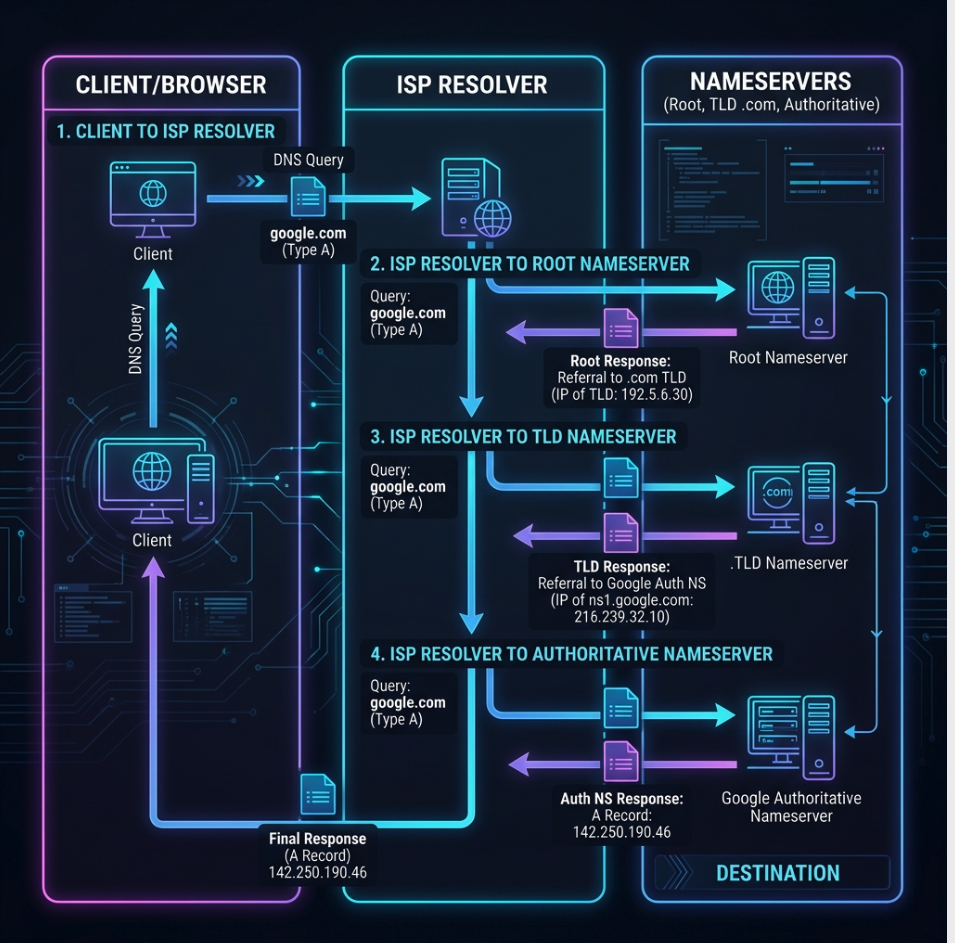
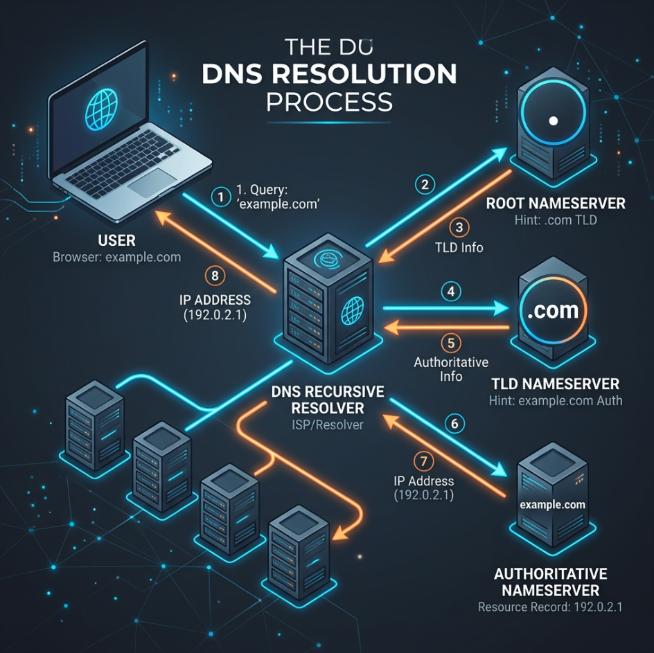

# DNS (Domain Name System) কীভাবে কাজ করে?

DNS-কে ইন্টারনেটের **ফোনবুক (Phonebook)** বলা হয়। আমরা যখন ব্রাউজারে কোনো ওয়েবসাইটের নাম (যেমন `example.com`) লিখি, কম্পিউটার কিন্তু এই নাম বোঝে না। কম্পিউটার বোঝে **IP Address** (যেমন `192.0.2.1`)। ডোমেইন নামকে IP অ্যাড্রেসে রূপান্তর করার এই পুরো প্রক্রিয়াটিই হলো **DNS Resolution**।

নিচে একটি সুন্দর ইনফোগ্রাফিক চিত্রের মাধ্যমে সম্পূর্ণ ধাপগুলো এবং প্রতিটি সার্ভারের ভূমিকা বিস্তারিত ব্যাখ্যা করা হলো।

---

## 🗺️ DNS Resolution Flow (ধাপসমূহ)

ডোমেইন রিকোয়েস্ট পাঠানোর পর ব্যাকএন্ডে সাধারণত নিচের ৮টি ধাপ সম্পন্ন হয়:

1. **User Request (ধাপ ১):** আপনি আপনার ব্রাউজারে (যেমন Chrome বা Firefox) `example.com` লিখে এন্টার চাপলেন। ব্রাউজার প্রথমে তার নিজস্ব ক্যাশ (Cache) এবং কম্পিউটারের হোস্ট ফাইলে আইপি খোঁজে। না পেলে সে আপনার **ISP (Internet Service Provider)**-এর কাছে একটি কুয়েরি পাঠায়।
2. **DNS Recursive Resolver / ISP (ধাপ ২ ও ৮):** এটি হলো প্রথম স্টপ। এটিকে আপনি একজন লাইব্রেরিয়ানের সাথে তুলনা করতে পারেন, যে আপনার হয়ে বইটি খুঁজে দেওয়ার কাজ করবে। এটি যদি আগে থেকেই আইপিটি ক্যাশ করে না রাখে, তবে এটি ইন্টারনেটের মূল অবকাঠামোর কাছে অনুসন্ধান শুরু করে।
3. **Root Nameserver (ধাপ ৩):** রিসলভার প্রথমে যায় **Root Server**-এর কাছে। রুট সার্ভার সরাসরি আইপি জানে না, তবে সে জানে ডোমেইনের শেষ অংশ (TLD - যেমন `.com`, `.net`, `.org`) এর তথ্য কার কাছে আছে। সে রিসলভারকে **TLD Server**-এর ঠিকানা দিয়ে দেয়।
4. **TLD Nameserver (ধাপ ৪ ও ৫):** রিসলভার এবার রুট সার্ভারের দেওয়া তথ্য নিয়ে **TLD (Top-Level Domain) Server**-এর কাছে যায় (ধরি `.com` সার্ভার)। এই সার্ভারটি জানে যে `.com` ডোমেইনগুলোর রেজিস্ট্রি কোথায় আছে। সে রিসলভারকে নির্দিষ্ট ডোমেইনের **Authoritative Nameserver**-এর ঠিকানা দেয়।
5. **Authoritative Nameserver (ধাপ ৬ ও ৭):** এটি হচ্ছে সর্বশেষ গন্তব্য। এই সার্ভারটির কাছে ওই ডোমেইনের আসল আইপি অ্যাড্রেস এবং সমস্ত রেকর্ড থাকে। ডোমেইনটি যে হোস্টিংয়ে পয়েন্ট করা আছে (যেমন cPanel, Cloudflare বা Namecheap), তার নেমসার্ভারই হলো Authoritative Server। এটি সঠিক IP Address (যেমন `192.0.2.1`) রিসলভারকে প্রদান করে।
6. **Response to Client:** সবশেষে, রিসলভার আইপিটি নিয়ে আপনার ব্রাউজারে ফেরত দেয় এবং ভবিষ্যতে দ্রুত লোড করার জন্য এটি ক্যাশ করে রাখে। ব্রাউজার তখন ওই আইপি ব্যবহার করে সরাসরি ওয়েব সার্ভারের সাথে যোগাযোগ করে ওয়েবসাইটটি লোড করে।

---

## 🖥️ DNS অবকাঠামোর গুরুত্বপূর্ণ উপাদানসমূহ

| উপাদানের নাম | সহজ উদাহরণ/রূপক | প্রধান কাজ |
| :--- | :--- | :--- |
| **DNS Resolver (ISP)** | লাইব্রেরিয়ান (Librarian) | ইউজারের কাছ থেকে ডোমেইন নাম নিয়ে বাকি সার্ভারগুলোতে ঘুরে আইপি এনে দেয়। |
| **Root Server (.)** | লাইব্রেরির ইনডেক্স ডিরেক্টরি | যেকোনো খোঁজার প্রথম ধাপ। এটি ডোমেইনের এক্সটেনশন অনুযায়ী সঠিক TLD সার্ভার দেখায়। |
| **TLD Server (.com, .org, .net)** | লাইব্রেরির নির্দিষ্ট বুকশেলফ | নির্দিষ্ট এক্সটেনশনের (যেমন `.com`) সব ডোমেইনের নেমসার্ভারের ঠিকানা সংরক্ষণ করে। |
| **Authoritative Server** | আসল বইয়ের পৃষ্ঠা | ডোমেইনের চূড়ান্ত IP ঠিকানা এবং DNS রেকর্ড (A, MX, CNAME ইত্যাদি) ধারণ করে। |

---

## 🛠️ cPanel এবং Authoritative Server-এর সম্পর্ক

ইউজার হিসেবে আমরা যখন ডোমেইন কিনি (যেমন Namecheap, GoDaddy থেকে) এবং হোস্টিং কিনি (যেখানে cPanel থাকে), তখন আমরা মূলত **Authoritative Nameserver** সেটআপ করি।

1. **নেমসার্ভার আপডেট (NS Records):** 
   cPanel হোস্টিং কেনার পর আপনাকে কিছু নেমসার্ভার দেওয়া হয় (যেমন: `ns1.yourhost.com` এবং `ns2.yourhost.com`)। আপনি আপনার ডোমেইন প্রোভাইডারের প্যানেলে গিয়ে এই নেমসার্ভারগুলো বসিয়ে দেন। এর ফলে বিশ্বজুড়ে TLD সার্ভারগুলো জেনে যায় যে আপনার ডোমেইনের **Authoritative Server** কোনটি।
   
2. **cPanel DNS Zone Editor:**
   cPanel-এর ভেতরে একটি টুল থাকে যাকে বলা হয় **Zone Editor**। এখানে আপনি বিভিন্ন রেকর্ড তৈরি করেন:
   * **A Record:** ডোমেইনটিকে আপনার হোস্টিং সার্ভারের আইপির সাথে কানেক্ট করে। (যেমন: `example.com` -> `192.0.2.1`)
   * **MX Record:** আপনার ইমেইল আদান-প্রদান কোন মেইল সার্ভার দিয়ে হবে তা ঠিক করে।
   * **CNAME Record:** এক ডোমেইন থেকে অন্য ডোমেইনে রিডিরেক্ট বা সাবডোমেইন পয়েন্ট করতে সাহায্য করে (যেমন: `www.example.com` -> `example.com`)।

যখনই ডোমেইনের কোনো রেকর্ডে পরিবর্তন করা হয়, cPanel তার নিজস্ব Authoritative Nameserver-এর ডাটাবেজ আপডেট করে ফেলে। পরবর্তী সময়ে কেউ ওয়েবসাইট ভিজিট করতে চাইলে DNS Resolver সরাসরি এই cPanel-এর আপডেট করা নেমসার্ভার থেকে সঠিক আইপিটি সংগ্রহ করে।

---

> [!NOTE]  
> একবার ডোমেইনের নেমসার্ভার পরিবর্তন করলে তা বিশ্বব্যাপী ছড়িয়ে পড়তে (Propagate হতে) কয়েক মিনিট থেকে শুরু করে সর্বোচ্চ ২৪-৪৮ ঘণ্টা পর্যন্ত সময় নিতে পারে। একে **DNS Propagation Time** বলা হয়।
