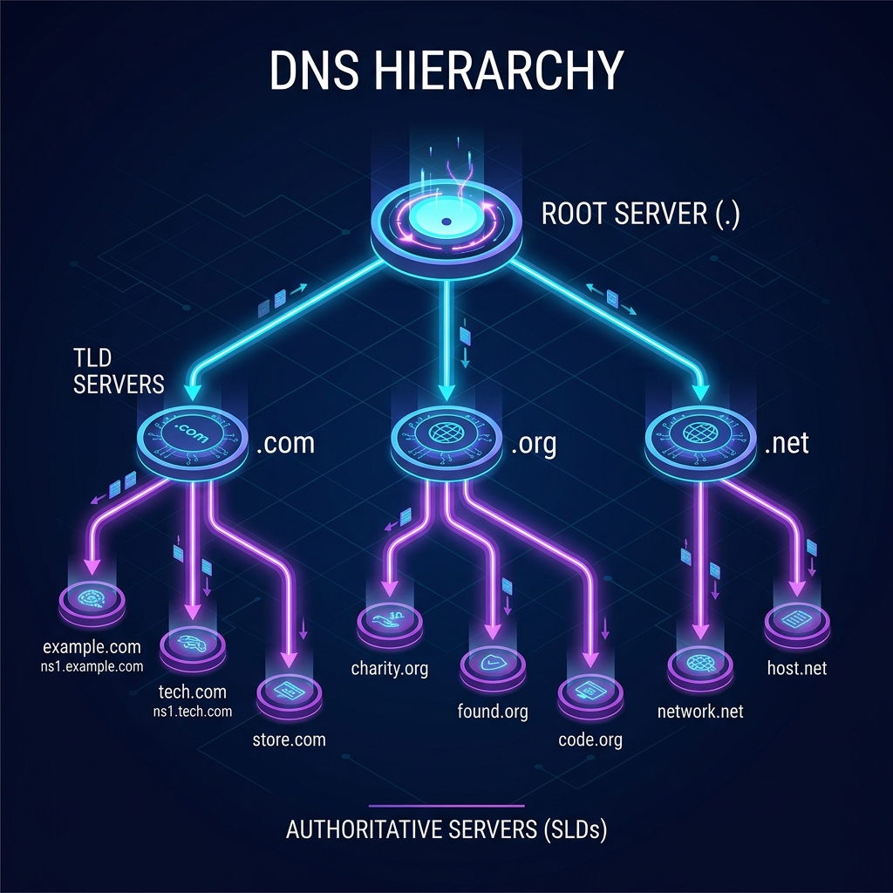

# DNS অবকাঠামো, অর্থনৈতিক মডেল এবং হায়ারার্কি বিশ্লেষণ

ইন্টারনেটের ব্যাকএন্ডের এই আর্থিক ও কারিগরি অবকাঠামোটি অত্যন্ত আকর্ষণীয়। চলুন পানির মতো সহজ করে প্রতিটি গুরুত্বপূর্ণ অংশের ভূমিকা ও প্রয়োজনীয়তা জেনে নেওয়া যাক।





---

## ১. Root Nameserver কার কাছে থাকে এবং এদের টাকা কে দেয়?

রুট সার্ভারগুলো কোনো একক ব্যক্তি বা কোম্পানির মালিকানাধীন নয়। ইন্টারনেটের স্থায়িত্ব ও নিরাপত্তার জন্য এটি বিশ্বজুড়ে ছড়িয়ে রাখা হয়েছে।

* **কার কাছে আছে এবং কারা চালায়?**  
  পৃথিবীতে লজিক্যাল রুট সার্ভার মাত্র **১৩টি** (এদের নাম `a.root-servers.net` থেকে `m.root-servers.net` পর্যন্ত)। কিন্তু শারীরিকভাবে (Physically) বিশ্বজুড়ে **১৫০০-এর বেশি** রুট সার্ভার ইনস্টল করা আছে। এগুলো চালায় ১২টি স্বাধীন প্রতিষ্ঠান। যেমন:
  * মার্কিন যুক্তরাষ্ট্রের মিলিটারি (US Army Research Lab)
  * নাসা (NASA)
  * ইউনিভার্সিটি অব মেরিল্যান্ড
  * **ICANN** (ইন্টারনেটের মূল নিয়ন্ত্রক সংস্থা)
  * ভেরিসাইন (Verisign)
  * সুইডেনের Netnod ইত্যাদি।

* **কে এটি ব্যবহার করে?**  
  বিশ্বের সকল **DNS Recursive Resolver** (আপনার ISP, Google-এর 8.8.8.8, বা Cloudflare)। সাধারণ ব্যবহারকারীরা সরাসরি রুট সার্ভারে যান না, তাদের হয়ে ISP Resolver সেখানে কুয়েরি করে।

* **এদের টাকা কে দেয় (Funding)?**  
  রুট সার্ভার চালানোর খরচ মূলত সংশ্লিষ্ট অপারেটররা নিজেরাই বহন করে। কারণ এটি বৈশ্বিক ইন্টারনেটের একটি মৌলিক সেবা। নাসা বা ইউএস মিলিটারি তাদের নিজস্ব বাজেট থেকে খরচ দেয়, বিশ্ববিদ্যালয়গুলো তাদের গবেষণার বাজেট থেকে দেয়। এছাড়া ICANN এবং বিভিন্ন ইন্টারনেট সংস্থার ডোনেশন ও স্পনসরশিপের মাধ্যমে এই তহবিল আসে।


---

## ২. TLD Nameserver-এর খরচ কে দেয়? (ডোমেইনের আসল খেলা)

TLD (যেমন `.com`, `.net`, `.org`, `.bd`) সার্ভারগুলো চালানোর খরচ ও লাভ পুরোটাই আসে গ্রাহকদের পকেট থেকে (ডোমেইন রেজিস্ট্রেশন ফি)।

* **রেজিস্ট্রি কোম্পানি (Registry Operator):**  
  প্রতিটি TLD এক্সটেনশনের দেখভালের জন্য একটি করে মূল কোম্পানি বা সংস্থা থাকে। 
  * যেমন: `.com` এবং `.net`-এর মালিক হলো **Verisign** (ভেরিসাইন)।
  * `.org`-এর মালিক হলো **PIR** (Public Interest Registry)।
  * `.bd`-এর মালিক হলো বাংলাদেশ সরকার (**BTCL**)।

* **টাকা কীভাবে আসে?**  
  আপনি যখন GoDaddy বা Namecheap থেকে ১০ ডলারে একটি `.com` ডোমেইন কেনেন:
  1. GoDaddy সেখান থেকে প্রায় ৮.৫০ ডলার সরাসরি দিয়ে দেয় **Verisign**-কে (যেহেতু তারা `.com` TLD সার্ভার চালায়)।
  2. প্রতি ডোমেইন বিক্রির জন্য **ICANN** পায় ০.১৮ ডলার।
  3. বাকি সামান্য টাকা GoDaddy নিজেদের লাভ হিসেবে রাখে।
  
  যেহেতু বিশ্বে কোটি কোটি ডোমেইন রেজিস্টার্ড আছে, তাই ভেরিসাইনের মতো কোম্পানিগুলো প্রতি বছর আমাদের ডোমেইন ফি থেকে শত শত কোটি ডলার আয় করে। এই বিশাল ফান্ড দিয়েই তারা তাদের TLD নেমসার্ভারগুলোর সুপার-কম্পিউটার অবকাঠামো রক্ষণাবেক্ষণ করে।


---

## ৩. Authoritative Nameserver কীভাবে কাজ করে? (টেকনিক্যাল ব্যাখ্যা)

Authoritative Nameserver আসলে একটি সাধারণ সার্ভার কম্পিউটার, যার মধ্যে **DNS Server Software** (যেমন: BIND, PowerDNS, বা NSD) ইনস্টল করা থাকে।

### ক) জোন ফাইল (Zone File)
এই সার্ভারের ভেতর প্রতিটি ডোমেইনের জন্য একটি সাধারণ টেক্সট ফাইল থাকে, যাকে বলা হয় **Zone File**। এই ফাইলে ডোমেইনের সমস্ত রেকর্ড লেখা থাকে। দেখতে ঠিক এমন হয়:

```text
; yourdomain.com - এর জোন ফাইল
$TTL 86400
yourdomain.com.      IN SOA   ns1.hosting.com. admin.hosting.com. ( ... )
yourdomain.com.      IN NS    ns1.hosting.com.
yourdomain.com.      IN A     203.0.113.50      ; ওয়েবসাইট সার্ভারের আইপি
www.yourdomain.com.  IN CNAME yourdomain.com.
yourdomain.com.      IN MX 10 mail.yourdomain.com. ; মেইল সার্ভার
```

### খ) কুয়েরি আসার পর যেভাবে কাজ করে
1. **রিকোয়েস্ট গ্রহণ:** ISP Resolver যখন সবশেষে Authoritative Server-এর কাছে এসে বলে, *"ভাই, `yourdomain.com`-এর A Record (IP) দাও।"*
2. **সার্চিং:** সার্ভারের DNS সফটওয়্যারটি সাথে সাথে তার ডেটাবেজে `yourdomain.com`-এর জোন ফাইলটি খোলে।
3. **রেকর্ড ম্যাচিং:** জোন ফাইলে থাকা `IN A 203.0.113.50` লাইনটি খুঁজে বের করে।
4. **রেসপন্স পাঠানো:** সার্ভারটি সেই IP অ্যাড্রেসটি একটি ছোট ডেটা প্যাকেটে ভরে ইন্টারনেটের মাধ্যমে ISP Resolver-কে পাঠিয়ে দেয়। 

cPanel মূলত এই জোন ফাইলটিকে একটি গ্রাফিক্যাল ইন্টারফেস (Zone Editor) দিয়ে আমাদের জন্য সহজ করে দেয়, যাতে আমাদের কোড লিখে এই রেকর্ডগুলো এডিট করতে না হয়।


---

## ৪. `.com` ও `.net` যদি Verisign চালায়, তবে Root Server-এর দরকার কী?

আপনার মনে হতে পারে—যেহেতু আমরা সবাই জানি `.com` বা `.net` হলো ভেরিসাইনের, তাহলে সরাসরি ভেরিসাইনের কাছে না গিয়ে প্রথমে Root Server-এর কাছে যাওয়ার কী দরকার? এর পেছনে মূল কারণগুলো হলো:

* **TLD-এর সংখ্যা ১৫০০+:**  
  ইন্টারনেটে এখন আর শুধু গুটি কয়েক ডোমেইন এক্সটেনশন নেই। বর্তমানে পৃথিবীতে ১৫০০-এর বেশি TLD (Top-Level Domain) আছে (যেমন: `.org`, `.xyz`, `.ai`, `.বাংলা` ইত্যাদি)। প্রতিটি TLD আলাদা আলাদা কোম্পানি বা দেশের সরকার চালায়।
  যদি Root Server না থাকতো, তবে আপনার ISP-কে বিশ্বের এই ১৫০০+ টিএলডির সমস্ত সার্ভারের আইপি অ্যাড্রেস নিজের মেমোরিতে হার্ডকোড করে রাখতে হতো, যা প্রায় অসম্ভব।
* **রুট সার্ভার একীভূত ডিরেক্টরি (Single Point of Entry):**  
  রুট সার্ভার থাকার সুবিধা হলো, আপনার ISP-কে কেবল ১৩টি রুট সার্ভারের আইপি মনে রাখলেই চলে। রুট সার্ভার ট্রাফিক পুলিশের মতো কাজ করে সঠিক TLD সার্ভার দেখিয়ে দেয়।
* **ইন্টারনেটের নামকরণের কাঠামো (Tree Structure):**  
  ডোমেইন সিস্টেম একটি উল্টানো গাছের (Tree) মতো কাজ করে। আমরা যখন লিখি `example.com`, এটি আসলে `example.com.` (শেষে ডট থাকে, যা রুট নির্দেশ করে)। ডোমেইন রেজোলিউশন শুরুই হয় একদম গোড়া বা Root থেকে।


---

## ৫. Root Server-এই যদি সব থাকে, তবে TLD Server-এর কী দরকার?

আসলে রুট সার্ভারের কাছে সব তথ্য থাকে না বা রাখা সম্ভব নয়। কেন এদের আলাদা রাখা হয়েছে তা নিচে দেওয়া হলো:

* **ডেটার বিশাল আকার (Data Size Limit):**  
  বর্তমানে বিশ্বে প্রায় ৩৬ কোটিরও বেশি ডোমেইন রয়েছে। যদি রুট সার্ভারকে প্রতিটি ডোমেইনের আইপি রাখতে হতো, তবে রুট সার্ভারের ডেটাবেজ বিশাল বড় হয়ে যেত। ফলে সিঙ্ক এবং কুয়েরি করা ধীরগতির হয়ে পড়তো। রুট সার্ভার তাই কেবল ১৫০০+ TLD-র ঠিকানা রাখে।
* **সার্ভার লোড ও ট্রাফিক ম্যানেজমেন্ট (Load & Traffic):**  
  বিশ্বের প্রতি সেকেন্ডের শত কোটি রিকোয়েস্ট সরাসরি রুট সার্ভারে এলে তা ক্র্যাশ করবে। TLD সার্ভার থাকায় এই ট্রাফিকের চাপ চমৎকারভাবে ভাগ হয়ে যায়।
* **প্রশাসনিক বিকেন্দ্রীকরণ ও স্বাধীনতা (Decentralization):**  
  বাংলাদেশ সরকারের একটি বিভাগ `.bd` ডোমেইন নিয়ন্ত্রণ করে। TLD থাকায় বাংলাদেশ তার ডোমেইন সিস্টেম স্বায়ত্তশাসিতভাবে নিজেই চালাতে পারে, প্রতি ডোমেইন বুকিংয়ের জন্য বিশ্ব সংস্থাকে নক করতে হয় না।

> **শপিং মলের উদাহরণ:**  
> রুট সার্ভার হলো মলের গেটের **ডিরেক্টরি বোর্ড** (যা শুধু ফ্লোর বা ক্যাটাগরি দেখিয়ে দেয়)। TLD হলো মলের **নির্দিষ্ট ফ্লোর বা বিভাগ**। আর Authoritative Server হলো ওই ফ্লোরে থাকা **নির্দিষ্ট দোকান** (যেখান থেকে আসল পণ্য বা IP পাওয়া যায়)।
