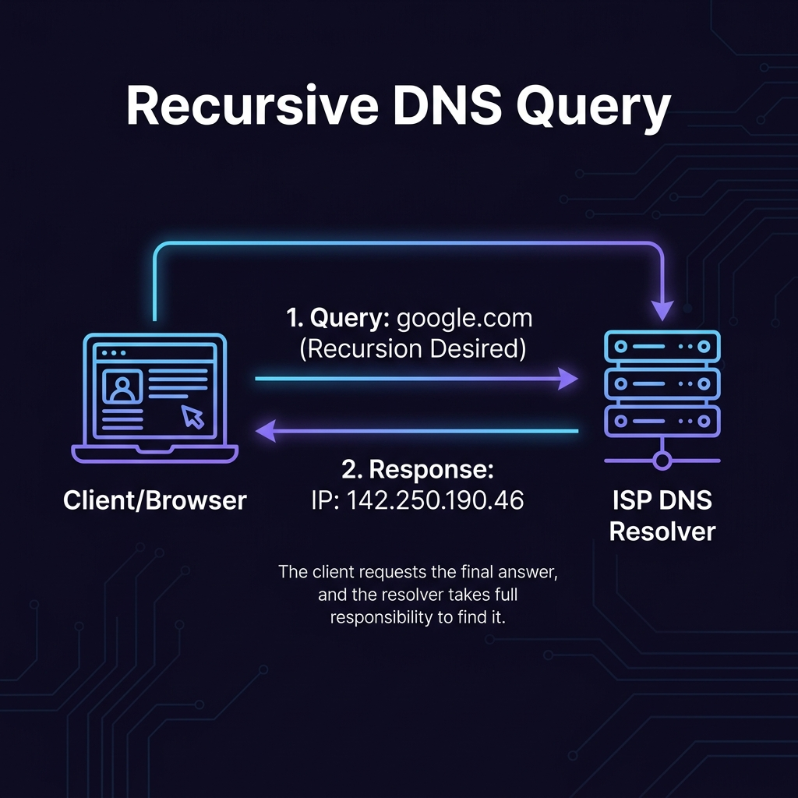
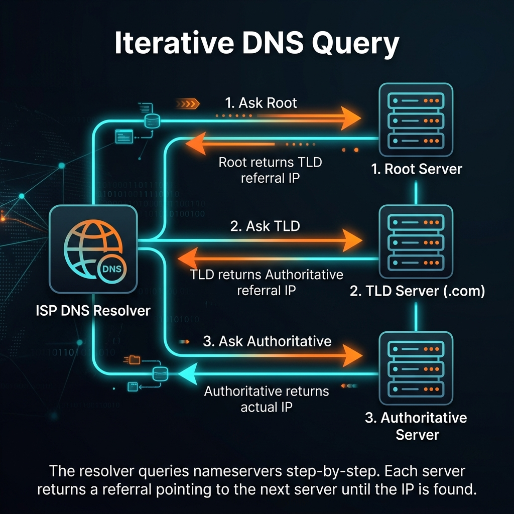

# Recursive vs. Iterative DNS Query কী এবং এরা কীভাবে কাজ করে?

DNS সিস্টেমে মূলত দুই ধরনের কুয়েরি বা জিজ্ঞাসাবাদের পদ্ধতি ব্যবহার করা হয়: **Recursive (অনুরোধমূলক)** এবং **Iterative (ধাপে ধাপে)**। 

আপনার ব্রাউজার যখন একটি সাইট লোড করার চেষ্টা করে, তখন **ISP Resolver** একই সাথে এই দুটি মেকানিজম ব্যবহার করে কাজ সম্পন্ন করে। নিচে দুটি চিত্রের মাধ্যমে এই দুই পদ্ধতির কার্যপ্রণালী সহজভাবে ব্যাখ্যা করা হলো।

---

## ১. Recursive DNS Query (অনুরোধমূলক কুয়েরি)

Recursive কুয়েরি হলো এমন একটি অনুরোধ যেখানে ক্লায়েন্ট (আপনার ব্রাউজার) সার্ভারকে (ISP Resolver-কে) বলে: **"আমাকে সরাসরি চূড়ান্ত উত্তরটি দাও। তুমি কীভাবে খুঁজবে তা আমার দেখার বিষয় নয়।"**

### এটি যেভাবে কাজ করে:
1. **Client to Resolver:** ব্রাউজার ISP Resolver-কে একটি রিকোয়েস্ট পাঠায়: *"আমাকে `google.com`-এর আইপি দাও।"* (এতে **Recursion Desired** ফ্ল্যাগ অন থাকে)।
2. **অপেক্ষা:** ক্লায়েন্ট নিজে আর কোনো কাজ করে না। সে চুপচাপ বসে থাকে।
3. **Response to Client:** ISP Resolver নিজে পুরো ইন্টারনেট ঘুরে আইপিটি খুঁজে নিয়ে সরাসরি ক্লায়েন্টকে ফেরত দেয়: *"এই নাও `142.250.190.46`।"*

> **সহজ উদাহরণ:** আপনি যখন কোনো রেস্টুরেন্টে গিয়ে ওয়েটারকে অর্ডার দেন—*"আমাকে এক কাপ চা দিন।"* আপনি কিন্তু রান্নাঘরে গিয়ে চা বানান না বা চিনি খোঁজেন না। ওয়েটারই পুরো কাজ করে সরাসরি আপনার টেবিলে চা এনে দেয়। এটি হলো **Recursive**।

---

## ২. Iterative DNS Query (ধাপে ধাপে কুয়েরি)

Iterative কুয়েরি হলো এমন একটি পদ্ধতি যেখানে কুয়েরি গ্রহণকারী সার্ভার সরাসরি উত্তর না জানলে আপনাকে অন্য কোনো সার্ভারের ঠিকানা দিয়ে দেয় (যাকে **Referral** বলে)। এখানে কুয়েরিকারীকে নিজে বারবার পরবর্তী সার্ভারে গিয়ে জিজ্ঞেস করতে হয়।

### এটি যেভাবে কাজ করে:
1. **Resolver to Root (ধাপ ১):** ISP Resolver রুট সার্ভারকে জিজ্ঞেস করে, *"গুগলের আইপি দাও।"* রুট সার্ভার বলে, *"আমি জানি না, তবে তুমি `.com` TLD সার্ভারের কাছে যাও (IP: 192.5.6.30)।"*
2. **Resolver to TLD (ধাপ ২):** ISP Resolver এবার `.com` TLD সার্ভারে গিয়ে জিজ্ঞেস করে, *"গুগলের আইপি দাও।"* TLD সার্ভার বলে, *"আমি জানি না, তবে গুগলের Authoritative নেমসার্ভারের কাছে যাও (IP: 216.239.32.10)।"*
3. **Resolver to Authoritative (ধাপ ৩):** ISP Resolver এবার গুগলের Authoritative নেমসার্ভারে গিয়ে জিজ্ঞেস করে। এই সার্ভারটি সরাসরি আইপি অ্যাড্রেসটি ফেরত দেয়।

> **সহজ উদাহরণ:** আপনি বাজারে গিয়ে একটি দোকানদারকে জিজ্ঞেস করলেন, *"ভাই, অমুক ব্র্যান্ডের জুতো আছে?"* দোকানদার বললো, *"না ভাই, আমার কাছে নেই। তবে ওই মোড়ের ৩ নম্বর গলির জুতোপট্টিতে দেখতে পারেন।"* আপনি তখন জুতোপট্টির দোকানে গিয়ে জুতোটি খুঁজে নিলেন। এটি হলো **Iterative**।

---

## ⚖️ একনজরে পার্থক্য

| বৈশিষ্ট্য | Recursive Query | Iterative Query |
| :--- | :--- | :--- |
| **মূল ধারণা** | সরাসরি চূড়ান্ত উত্তর বা এরর মেসেজ দিতে হবে। | চূড়ান্ত উত্তর জানা না থাকলে পরবর্তী সার্ভারের রেফারেন্স দেবে। |
| **কে করে?** | **Client/Browser** এটি করে **ISP Resolver**-এর কাছে। | **ISP Resolver** এটি করে **Root/TLD/Authoritative** সার্ভারগুলোর কাছে। |
| **কাজ কার বেশি?** | ক্লায়েন্টের কোনো কাজ নেই, পুরো কাজ সার্ভার (Resolver) করে। | কুয়েরিকারীকে (Resolver) প্রতিটি সার্ভারে নিজে গিয়ে বারবার জিজ্ঞেস করতে হয়। |
