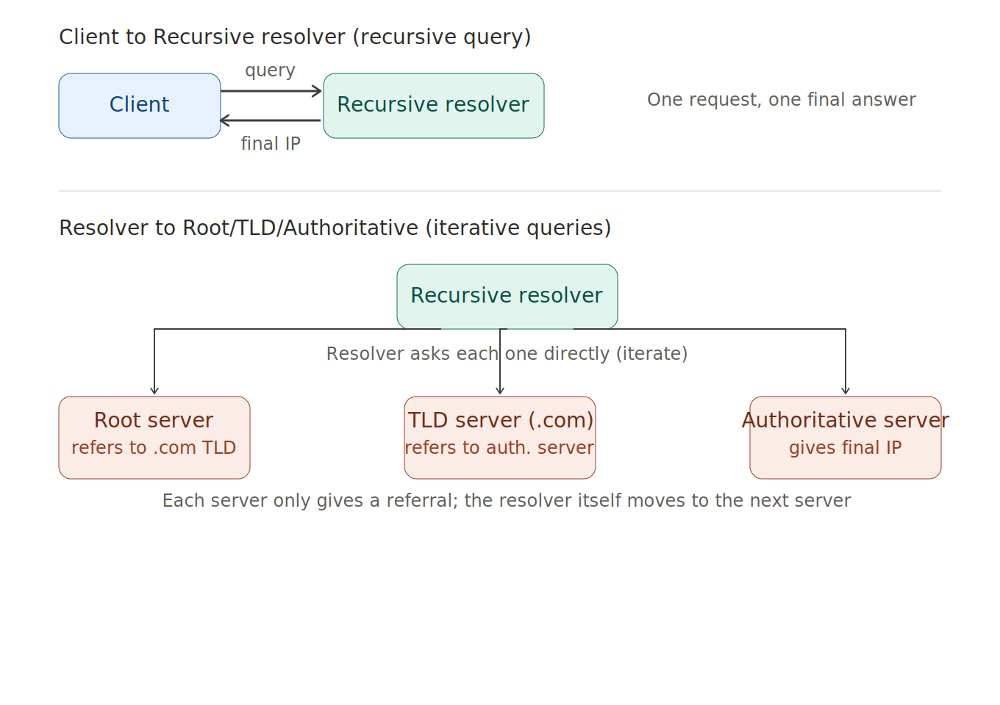
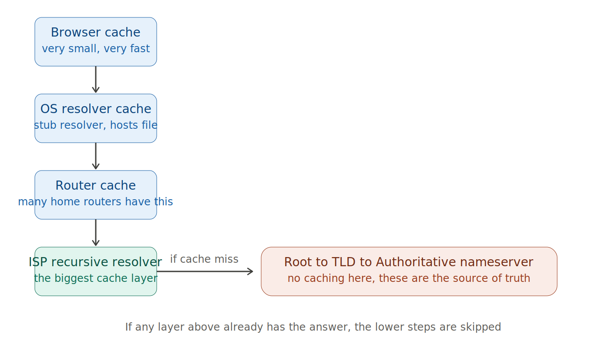

# Recursive Resolver vs Iterative Resolver

DNS (Domain Name System) resolution এর সময় দুই ধরনের "query" বা resolver behavior থাকে। চলো ভালো করে বুঝি।

## মূল পার্থক্য (সংক্ষেপে)

- **Recursive Resolver**: পুরো কাজটা নিজে শেষ করে, শেষ answer টাই client কে দেয়
- **Iterative Resolver**: যেটুকু জানে সেটুকু দেয়, বাকিটা client কে নিজে খুঁজে বের করতে বলে (referral দেয়)

## কিভাবে কাজ করে - বিস্তারিত

### Recursive Query

তুমি (client) যখন তোমার ISP-র DNS resolver-কে জিজ্ঞেস করো `www.example.com` এর IP কী, তখন সেই resolver **পুরো দায়িত্ব নেয়**। ও নিজে গিয়ে:

1. Root DNS server-কে জিজ্ঞেস করে
2. TLD (.com) server-কে জিজ্ঞেস করে
3. Authoritative server-কে জিজ্ঞেস করে
4. সবশেষে **final answer (IP address)** নিয়ে তোমাকে দেয়

তুমি শুধু একটাই request পাঠাও, আর এক final answer পাও। মাঝখানের সব কষ্ট resolver নিজে করে। এটাকে বলে "recursive" কারণ resolver নিজেই বার বার query চালায় যতক্ষণ না পুরো answer পায়।

### Iterative Query

এখন resolver যখন root server, TLD server, authoritative server-এর সাথে কথা বলে — সেই queries গুলো হলো **iterative**। মানে root server resolver-কে বলে না "এই নাও final answer", বরং বলে:

> "আমি জানি না www.example.com এর IP কী, কিন্তু আমি জানি .com এর জন্য কোন server জিজ্ঞেস করতে হবে — যাও ওদের জিজ্ঞেস করো।"

এটাকে বলে **referral**। প্রতিটা server শুধু তার নিজের এলাকার তথ্য দেয়, বাকিটা "next server" এর ঠিকানা দিয়ে referral করে দেয়। Resolver নিজেই এক server থেকে আরেক server-এ গিয়ে গিয়ে (iterate করে) শেষে আসল answer বের করে।

## গুরুত্বপূর্ণ পয়েন্টগুলো

**১. Recursive resolver একটা agent-এর মতো কাজ করে**
তোমার device (client) কখনো root, TLD বা authoritative server-এর সাথে সরাসরি কথা বলে না। ISP বা Google (8.8.8.8), Cloudflare (1.1.1.1) এর মতো recursive resolver তোমার হয়ে পুরো কাজটা করে দেয়।

**২. Iterative queries হলো resolver-এর "পিছনের কাজ"**
তুমি যেটা দেখো না, resolver ভেতরে ভেতরে সেই iterative queries চালায়:
- Root server → বলে "এই যাও .com TLD server-এর কাছে"
- TLD server → বলে "এই যাও example.com এর authoritative server-এর কাছে"
- Authoritative server → বলে "এই নাও IP address"

**৩. কেন এই দুই ধরনের approach দরকার?**
- যদি সব server-কেই recursive query handle করতে হতো, তাহলে root server আর TLD server-গুলোর উপর অবিশ্বাস্য load পড়ত (কোটি কোটি client সরাসরি ওদের কাছে যেত)
- তাই root/TLD/authoritative servers শুধু **iterative** ভাবে কাজ করে (শুধু referral দেয়) — কম load
- আর recursive resolver (caching সহ) সেই ভারী কাজটা নিজের কাঁধে নেয়, এবং **caching** এর মাধ্যমে বারবার একই query না করে দ্রুত answer দেয়

**৪. সহজ analogy**
তুমি (client) যদি একটা বই খুঁজতে লাইব্রেরিয়ানকে (recursive resolver) জিজ্ঞেস করো, লাইব্রেরিয়ান নিজে গিয়ে বিভিন্ন section-এ (root → TLD → authoritative) খুঁজে খুঁজে বই এনে তোমার হাতে দেয় — এটা recursive। কিন্তু প্রতিটা section-এর staff (root, TLD server) শুধু বলে "ঐ পাশের section-এ যাও" — এটা iterative referral।

---

## Follow-up: এটা কি আলাদা server, নাকি একই resolver-এর দুই রকম আচরণ?

### ১. Recursive vs Iterative — এটা "query-এর ধরন", "server-এর ধরন" না

এটা কোনো আলাদা server টাইপ না, বরং **কে কীভাবে জিজ্ঞেস করছে** সেটা বোঝায়:

- **Client → ISP resolver**: এটা recursive query, কারণ client শুধু final answer চায়, মাঝখানের কষ্ট করতে চায় না
- **ISP resolver → Root → TLD → Authoritative nameserver**: এগুলো iterative queries, কারণ প্রতিটা server শুধু referral দেয়, resolver নিজেই পরের ধাপে যায়

তাই "recursive resolver" আর "iterative resolver" বলতে literally আলাদা সফটওয়্যার বোঝায় না — বরং resolver যখন client-এর সাথে কথা বলে তখন সে **recursively** কাজ করে, আর যখন root/TLD/authoritative-এর সাথে কথা বলে তখন সে **iteratively** কাজ করে। Same resolver, দুই রকম behavior, দুই দিকে।

### ২. Nameserver-এ caching হয় না

Root, TLD আর authoritative nameserver-গুলো caching করে না। এরা হলো **source of truth** — zone file থেকে সরাসরি answer দেয় (বা referral দেয়)। ক্যাশিং এদের দরকারই নেই, কারণ এরাই তো original data রাখে।

### ৩. Caching কোথায় কোথায় হয়

## সংক্ষেপে

- **Recursive** = client থেকে ISP resolver পর্যন্ত এক-request-এক-answer relationship (query type)
- **Iterative** = ISP resolver থেকে root/TLD/authoritative পর্যন্ত referral-চেইন (query type)
- **Caching** হয় client-side (browser, OS, router) আর resolver-side (ISP recursive resolver) — এগুলোই সব "middle-man" যারা বারবার একই কাজ করতে চায় না
- **Authoritative nameserver**-এ caching নেই, কারণ ওটাই তো original data-র জায়গা — cache করার কিছু নেই, ও নিজেই source

তোমার মূল ধারণাটা সঠিক ছিল, শুধু "resolver" শব্দটা দুই context-এ দুই রকম ব্যবহার হয় বলে একটু গুলিয়ে যাচ্ছিল।
