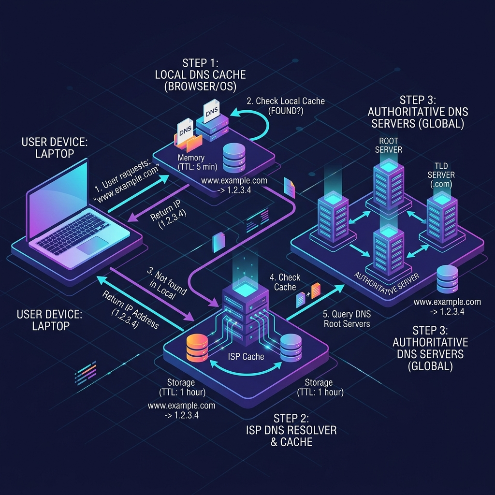

# DNS Caching এবং IP Propagation-এর খুঁটিনাটি

ওয়েবসাইট ভিজিট করার গতি বাড়ানো এবং ইন্টারনেটের ট্রাফিক কমানোর জন্য DNS সিস্টেমে **Caching (ক্যাশিং)** একটি অত্যন্ত গুরুত্বপূর্ণ বিষয়। নিচে ক্যাশিং কে করে, ক্যাশ থাকা অবস্থায় সার্ভারের আইপি পরিবর্তন করলে কী সমস্যা হয় এবং ডেভেলপাররা কীভাবে এটি এড়ান তা বিস্তারিত আলোচনা করা হলো।

---

## ১. আসলে ক্যাশ করে কে? (Who Caches?)

আপনার ডোমেইনের Authoritative Nameserver যখন একটি নির্দিষ্ট **TTL (Time to Live)** সহ আইপি অ্যাড্রেস পাঠায়, তখন সেই তথ্যটি যার যার হাত দিয়ে অতিক্রম করে, তারা সবাই নিজ নিজ মেমোরিতে এটি জমা করে রাখে। অর্থাৎ, পুরো নেটওয়ার্কের প্রতিটি ধাপে ক্যাশিংয়ের একটি করে স্তর থাকে:

1. **ISP Resolver (আইএসপি ক্যাশ):** এটি সবচেয়ে বড় এবং গুরুত্বপূর্ণ ক্যাশিং লেয়ার। আপনার ইন্টারনেট প্রোভাইডার (যেমন: Link3, GP, AmberIT) আইপিটি ডোমেইনের নির্ধারিত TTL সময় পর্যন্ত সেভ করে রাখে।
2. **ওয়াইফাই রাউটার (Router Cache):** আপনার বাসার ওয়াইফাই রাউটারও তার নিজস্ব ক্ষুদ্র মেমোরিতে এই DNS রেকর্ডটি সেভ করে রাখে।
3. **কম্পিউটার/মোবাইল ওএস (OS Cache):** উইন্ডোজ, ম্যাক বা অ্যান্ড্রয়েড অপারেটিং সিস্টেম নিজেই লোকাল মেমোরিতে আইপিটি জমিয়ে রাখে।
4. **ব্রাউজার (Browser Cache):** গুগল ক্রোম, ফায়ারফক্স বা সাফারি তাদের নিজস্ব ব্রাউজার মেমোরিতে এটি সেভ করে। ব্রাউজার সাধারণত নিরাপত্তার স্বার্থে খুব বেশি সময় ক্যাশ রাখে না (সর্বোচ্চ ১-২ মিনিট)।

---

## ২. ক্যাশ থাকা অবস্থায় সার্ভার আইপি পরিবর্তন করলে কী হবে?

এই অবস্থাকে নেটওয়ার্কিংয়ের ভাষায় বলা হয় **DNS Propagation Delay** (অর্থাৎ, বিশ্বব্যাপী সব ক্যাশ মুছে গিয়ে নতুন আইপি আপডেট হওয়ার মধ্যবর্তী সময়)।

ধরা যাক, আপনার ডোমেইনের TTL সেট করা আছে **২৪ ঘণ্টা (86400 সেকেন্ড)**। আপনি দুপুর ১২টায় cPanel-এ গিয়ে ডোমেইনের মেইন সার্ভার আইপি পরিবর্তন করে দিলেন:
* **সমস্যা:** বিশ্বজুড়ে যেসব আইএসপি বা ব্রাউজার ইতোমধ্যে আপনার ডোমেইন ভিজিট করেছে, তারা তাদের ক্যাশের মেয়াদ (২৪ ঘণ্টা) শেষ না হওয়া পর্যন্ত পুরানো আইপি-তেই ভিজিটরদের পাঠাতে থাকবে।
* **ফলাফল:** ভিজিটররা পুরানো সার্ভারের ওয়েবসাইট দেখতে পাবে। যদি পুরানো সার্ভারটি বন্ধ করে দেওয়া হয়, তবে তারা এরর বা ওয়েবসাইট ডাউন দেখতে পাবে। শুধুমাত্র যারা নতুন ভিজিটর (যাদের কোনো ক্যাশ নেই), তারা সরাসরি নতুন সার্ভারে প্রবেশ করবে। ২৪ ঘণ্টা পার হওয়ার পর সবার কাছে নতুন আইপি আপডেট হবে।

---

## 💡 ডেভেলপাররা এই সমস্যা কীভাবে এড়ান? (Best Practice)

আপনি যখন আপনার ওয়েবসাইট এক সার্ভার থেকে অন্য সার্ভারে ট্রান্সফার বা মাইগ্রেশন (Migration) করতে চাইবেন, তখন কোনো ডাউনটাইম ছাড়াই এটি করার আদর্শ নিয়ম হলো:

1. **মাইগ্রেশনের ১-২ দিন আগে:** cPanel বা Cloudflare-এ গিয়ে আপনার ডোমেইনের TTL কমিয়ে **৫ মিনিট (300 সেকেন্ড)** করে দিন।
2. **অপেক্ষা করুন:** অন্তত ১ দিন অপেক্ষা করুন, যাতে সারা বিশ্বের সব আইএসপির পুরানো দীর্ঘমেয়াদী ক্যাশ মুছে যায় এবং সবার কাছে ৫ মিনিটের নতুন ক্যাশ চলে আসে।
3. **আইপি পরিবর্তন করুন:** এবার সার্ভারের নতুন আইপিটি বসিয়ে দিন। যেহেতু এখন TTL মাত্র ৫ মিনিট, তাই মাত্র ৫ মিনিটের মধ্যেই সারা বিশ্বের সমস্ত ক্যাশ আপডেট হয়ে সবাই নতুন সার্ভারের ওয়েবসাইট দেখতে পাবে।
4. **TTL বাড়িয়ে দিন:** মাইগ্রেশন সফলভাবে শেষ হয়ে গেলে এবং ওয়েবসাইট ঠিকঠাক চললে TTL আবার বাড়িয়ে ১ ঘণ্টা বা ২৪ ঘণ্টা করে দিন, যাতে আপনার DNS সার্ভারের ওপর বারবার ট্রাফিকের কুয়েরি লোড না পড়ে।
