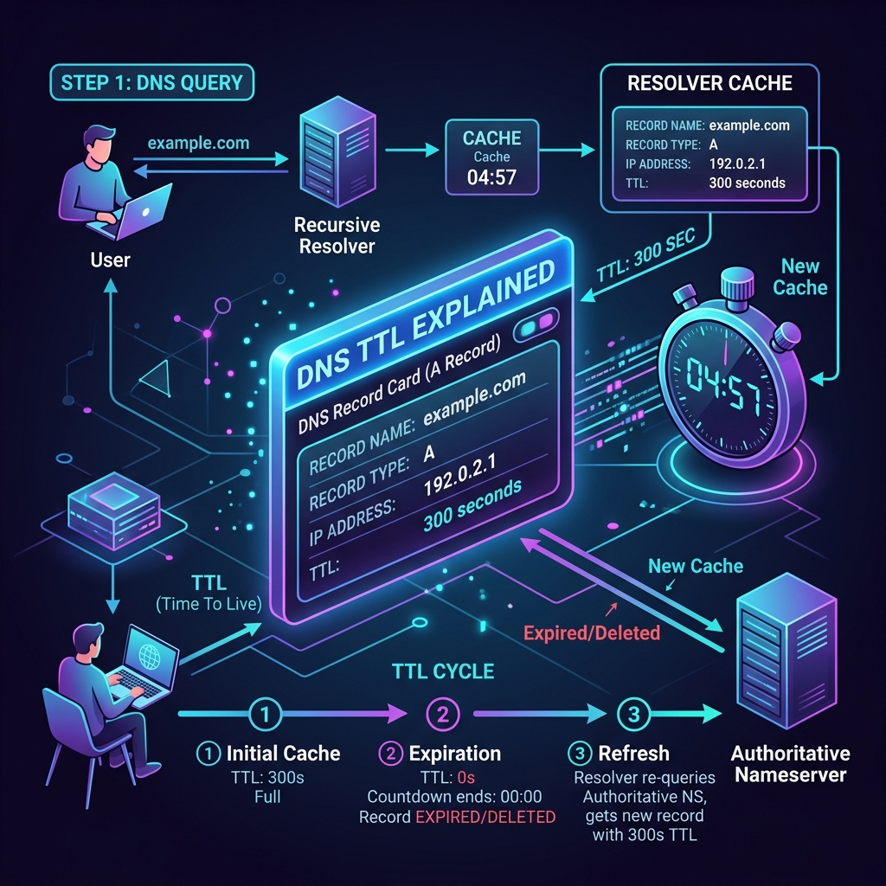

# DNS TTL (Time to Live) কনফিগারেশন এবং কার্যপ্রণালী

ডোমেইন রেকর্ডের ক্যাশিং সময়সীমা নির্ধারণ করার জন্য **TTL (Time to Live)** ব্যবহার করা হয়। এটি কোথায় সেট করা থাকে এবং কীভাবে কাজ করে তা নিচে আলোচনা করা হলো।

---

## ১. TTL কোথায় সেট বা যুক্ত করা থাকে?

ডোমেইনের মালিক হিসেবে আপনি নিজে আপনার **Authoritative Nameserver-এ (যেমন: cPanel বা Cloudflare-এর DNS Zone Editor-এ)** প্রতিটা রেকর্ডের সাথে এই TTL বা ক্যাশিং টাইম নির্ধারণ করে দেন।

আপনি যখন cPanel বা Cloudflare-এ কোনো **A Record** বা **MX Record** যোগ করেন, তখন সেখানে ৩টি প্রধান ফিল্ড থাকে:

* **Name:** `yourdomain.com`
* **Type:** `A`
* **TTL:** `3600` (সেকেন্ডে হিসাব করা হয়। ৩৬০০ সেকেন্ড মানে ১ ঘণ্টা)
* **Value (IP):** `203.0.113.50`

---

## ২. এটি কীভাবে কাজ করে?

* **ধাপ ১:** যখন কোনো ভিজিটর আপনার সাইটে আসতে চায়, তার ISP Resolver আপনার নেমসার্ভার থেকে আইপি (`203.0.113.50`) এবং সাথে এই `TTL = 3600` সেকেন্ডের মানটি নিয়ে যায়।
* **ধাপ ২:** ISP Resolver তার নিজের মেমোরিতে লিখে রাখে: *"এই আইপিটি আমি আগামী ১ ঘণ্টার (৩৬০০ সেকেন্ড) জন্য ক্যাশ করে রাখলাম।"*
* **ধাপ ৩:** আগামী ১ ঘণ্টার মধ্যে যতবারই মানুষ আপনার সাইটে যাওয়ার চেষ্টা করবে, ISP আপনার সার্ভারকে আর ডিস্টার্ব করবে না। সে তার ক্যাশ থেকেই সরাসরি আইপি দিয়ে দেবে।
* **ধাপ ৪:** ১ ঘণ্টা পার হয়ে গেলে ক্যাশটি অটোমেটিক ডিলিট হয়ে যাবে। এরপর আবার নতুন করে আপনার নেমসার্ভার থেকে আইপি ও নতুন TTL নিয়ে ক্যাশ আপডেট করা হবে।

---

## ৩. সাধারণ কিছু TTL মান (Common TTL Values)

* **Auto (Cloudflare-এ থাকে):** এটি সাধারণত ৩০০ সেকেন্ড বা ৫ মিনিটের ক্যাশ টাইম সেট করে।
* **3600 (১ ঘণ্টা):** সবচেয়ে বেশি ব্যবহৃত সাধারণ মান।
* **86400 (২৪ ঘণ্টা):** যদি আপনার ওয়েবসাইটের আইপি ঘন ঘন পরিবর্তন হওয়ার সম্ভাবনা না থাকে, তবে ক্যাশ লোড কমানোর জন্য ২৪ ঘণ্টা সেট করে রাখা ভালো।
