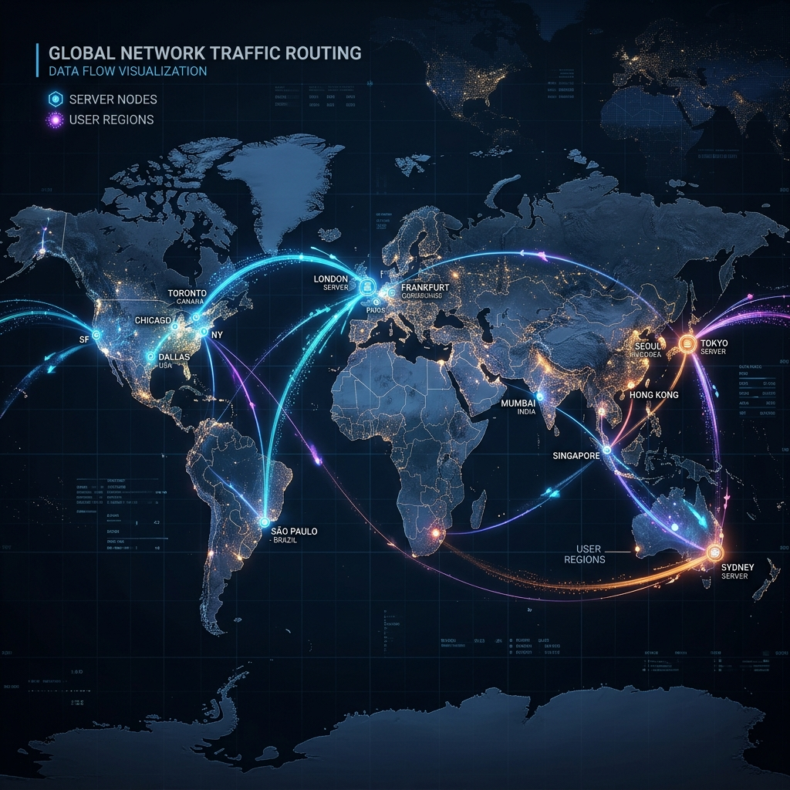
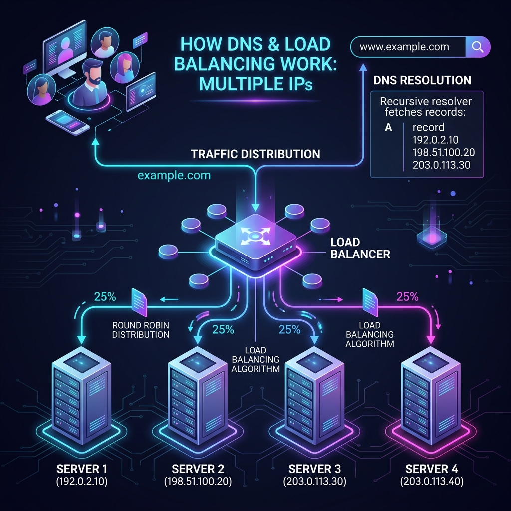

# Multiple IP Address হ্যান্ডলিং এবং DNS রাউটিং মেকানিজম

ডোমেইনের বিপরীতে যখন একাধিক আইপি অ্যাড্রেস (Multiple IP Addresses) ফেরত আসে, তখন কোনটি কল করা হবে তা নিয়ে খুব সুন্দর একটি মেকানিজম কাজ করে। এখানে ব্রাউজার এবং ডেভেলপার—দুজনেরই আলাদা ভূমিকা রয়েছে।

---

## ১. সাধারণ ইউজারের ব্রাউজার কীভাবে কাজ করে? (Client-Side)

যখন একটি ডোমেইনের বিপরীতে একাধিক আইপি-র লিস্ট ব্রাউজারের কাছে আসে (যেমন: `[192.0.2.1, 192.0.2.2, 192.0.2.3]`), তখন ব্রাউজার নিজেই সিদ্ধান্ত নেয়:

* **প্রথম আইপি ট্রাই করা (Primary Connection):** ব্রাউজার সাধারণত তালিকার প্রথম আইপি অ্যাড্রেসটিতে কানেক্ট করার চেষ্টা করে।
* **অটোমেটিক ফেইলওভার (Failover):** যদি কোনো কারণে প্রথম আইপি-র সার্ভারটি ডাউন থাকে বা রেসপন্স না করে, তবে ব্রাউজার ব্যবহারকারীকে কোনো এরর না দেখিয়ে অত্যন্ত দ্রুত তালিকার ২য় আইপিটিতে কানেক্ট করার চেষ্টা করে। এভাবে সে লিস্টের শেষ পর্যন্ত চেষ্টা করতে থাকে।

---

## ২. ডোমেইন বা সাইটের মালিক হিসেবে কি আপনি এটি কন্ট্রোল করতে পারবেন?

**হ্যাঁ, পারবেন।** তবে এটি ব্রাউজারের ভেতর থেকে ডিফাইন করা যায় না, এটি ডিফাইন করতে হয় **DNS Server লেভেলে**। এর কয়েকটি জনপ্রিয় উপায় হলো:

### ক) Round Robin DNS (লোডের ভারসাম্য রাখা)
আপনি আপনার Authoritative Server-এ একাধিক আইপি সেট করে রাখলেন। DNS সার্ভার প্রতিবার কুয়েরির উত্তর দেওয়ার সময় আইপির সিকোয়েন্স ঘুরিয়ে দেয়:
* **১ম ইউজারের রিকোয়েস্টে সার্ভার দিল:** `[IP-A, IP-B, IP-C]` (ইউজার কানেক্ট হবে IP-A তে)
* **২য় ইউজারের রিকোয়েস্টে সার্ভার দিল:** `[IP-B, IP-C, IP-A]` (ইউজার কানেক্ট হবে IP-B তে)
* **৩য় ইউজারের রিকোয়েস্টে সার্ভার দিল:** `[IP-C, IP-A, IP-B]` (ইউজার কানেক্ট হবে IP-C তে)

এর ফলে ভিজিটররা অটোমেটিক ৩টি সার্ভারে সমান ভাগে ভাগ হয়ে যায়।

### খ) GeoDNS / Latency-Based Routing (ভৌগোলিক অবস্থান অনুযায়ী)
আপনি যদি Amazon Route 53 বা Cloudflare ব্যবহার করেন, তবে আপনি ডিফাইন করে দিতে পারেন:
* ভিজিটর যদি **বাংলাদেশ** থেকে রিকোয়েস্ট করে, তবে তাকে আপনার **সিঙ্গাপুর** সার্ভারের আইপি দেওয়া হবে।
* ভিজিটর যদি **ইউএসএ** থেকে রিকোয়েস্ট করে, তবে তাকে **নিউ ইয়র্ক** সার্ভারের আইপি দেওয়া হবে। 

এক্ষেত্রে ব্রাউজার কেবল তার এলাকার জন্য নির্দিষ্ট আইপিটিই পায় এবং সেটিকেই কল করে।

### গ) Anycast Routing (সবচেয়ে আধুনিক পদ্ধতি)
গুগল বা ক্লাউডফ্লেয়ার এই পদ্ধতি ব্যবহার করে। তারা বিশ্বজুড়ে তাদের শত শত সার্ভারের জন্য একটি মাত্র আইপি ব্যবহার করে। ব্রাউজার যখন ওই একটি আইপিতে রিকোয়েস্ট পাঠায়, তখন ইন্টারনেটের রাউটারগুলো স্বয়ংক্রিয়ভাবে সেই রিকোয়েস্টটিকে সবচেয়ে কাছের ফিজিক্যাল সার্ভারে পাঠিয়ে দেয়।

---

## 📝 সারসংক্ষেপ

* **ব্রাউজার নিজে:** সে প্রাপ্ত তালিকার প্রথম সচল আইপিটিতে কানেক্ট করে। একটি ডাউন হলে পরেরটিতে যায়।
* **আপনি (ডেভেলপার):** আপনি DNS ম্যানেজমেন্ট (যেমন Cloudflare বা Route 53) দিয়ে ব্রাউজারকে কোন আইপি বা কোন অর্ডারে আইপি পাঠানো হবে তা নির্ধারণ করতে পারেন।
