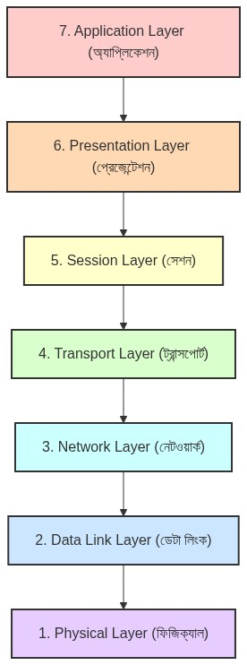
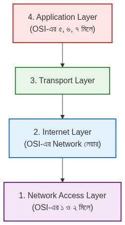

# নেটওয়ার্ক কানেকশন এবং সিকিউরিটি কনসেপ্টস (OSI)

এই ডকুমেন্টে ইন্টারনেট ব্রাউজিং, কানেকশন তৈরি এবং ডেটা সিকিউরিটির বিভিন্ন গুরুত্বপূর্ণ বিষয় ধাপে ধাপে বিস্তারিত আলোচনা করা হয়েছে।

---

## ১. DNS থেকে IP পাওয়ার পরের ধাপগুলো (TCP ও TLS)
DNS থেকে ওয়েবসাইটের IP Address পেয়ে যাওয়ার পর ব্রাউজার (যেমন: ক্রোম বা মজিলা) এবং ওয়েবসাইটের সার্ভারের মধ্যে মূলত কয়েকটি গুরুত্বপূর্ণ ধাপ পার হতে হয়। 

IP Address পাওয়ার পর প্রধানত দুটো জিনিস ঘটে: **১. TCP কানেকশন তৈরি হওয়া** এবং **২. TLS হ্যান্ডশেক (TLS Handshake)।**

### ১.১ TCP কানেকশন তৈরি (TCP 3-Way Handshake)
IP অ্যাড্রেস তো পেয়ে গেছেন, তার মানে আপনি জানেন সার্ভারের বাড়ি কোথায়। এখন সেখানে গিয়ে তো সোজা দরজায় ধাক্কা দেওয়া যায় না, আগে একটা সম্পর্ক বা কানেকশন তৈরি করতে হয়। এটাকে বলে TCP 3-Way Handshake (তিন ধাপের করমর্দন)। 

এটি অনেকটা ফোনে কথা বলার মতো:
1. **প্রথম ধাপ (SYN):** আপনার ব্রাউজার সার্ভারকে বলে, "হ্যালো সার্ভার! আমি কি আপনার সাথে ডেটা আদান-প্রদান করতে পারি?"
2. **দ্বিতীয় ধাপ (SYN-ACK):** সার্ভার উত্তর দেয়, "হ্যাঁ ভাই, আমি রেডি আছি। আপনি কি আমার কথা শুনতে পাচ্ছেন?"
3. **তৃতীয় ধাপ (ACK):** আপনার ব্রাউজার বলে, "হ্যাঁ, শুনতে পাচ্ছি। চলেন এবার কাজ শুরু করি।"

ব্যাস! আপনার ব্রাউজার এবং সার্ভারের মধ্যে একটি রাস্তা বা কানেকশন তৈরি হয়ে গেলো।

### ১.২ TLS কানেকশন তৈরি (TLS Handshake)
TCP কানেকশন হওয়ার পরপরই এই TLS হ্যান্ডশেক শুরু হয়। 

**TLS কেন লাগে?**
ধরুন, আপনি ফেসবুকে লগইন করার জন্য পাসওয়ার্ড দিচ্ছেন বা ব্যাংকের ওয়েবসাইটে কার্ডের পিন দিচ্ছেন। যদি মাঝখান দিয়ে কেউ সেটা পড়ে ফেলে, তাহলে তো বিপদ! TLS (Transport Layer Security) এর কাজ হলো আপনার ব্রাউজার এবং সার্ভারের মধ্যকার রাস্তাটাকে একটা 'গোপন সুড়ঙ্গ' বানিয়ে দেওয়া। যাতে ডেটা যাওয়ার সময় সব কিছু হিজিবিজি (এনক্রিপ্ট) হয়ে যায় এবং মাঝখানে কেউ দেখলেও যেন কিছু বুঝতে না পারে।

**TLS কীভাবে কানেক্ট হয় বা প্রসেসটা কী?**
এর ধাপগুলো হলো:
1. **Client Hello (ক্লায়েন্টের সালাম):** আপনার ব্রাউজার সার্ভারকে বলে, "ভাই, আমি তো তোমার সাথে সিকিউর বা নিরাপদ লাইনে কথা বলতে চাই। আমি এই এই তালা-চাবির (Encryption) সিস্টেমগুলো বুঝি। তুমি এর মধ্যে কোনটা ব্যবহার করতে চাও?"
2. **Server Hello & Certificate (সার্ভারের উত্তর ও আইডি কার্ড):** সার্ভার তখন ব্রাউজারের দেওয়া অপশনগুলো থেকে একটা বেছে নেয়। এরপর সে তার একটা ডিজিটাল আইডি কার্ড বা **SSL Certificate** ব্রাউজারকে পাঠায়। এর মানে সে প্রমাণ দেয়, "আমিই আসল সার্ভার, অন্য কোনো ভুয়া লোক না।" 
3. **Authentication (আইডি কার্ড চেক):** আপনার ব্রাউজার খুব চালাক। সে সার্ভারের পাঠানো আইডি কার্ডটা চেক করে দেখে সেটা আসল কি না। 
4. **Key Exchange (গোপন চাবি তৈরি):** আইডি কার্ড আসল প্রমাণ হলে, ব্রাউজার এবং সার্ভার মিলে নিজেদের মধ্যে একটা 'গোপন চাবি' (Session Key) বানায়। এই চাবিটা শুধু তাদের দুজনের কাছেই থাকে, দুনিয়ার আর কারও কাছে থাকে না।
5. **Secure Connection (নিরাপদ লেনদেন শুরু):** এবার দুজনেই বলে, "ঠিক আছে, এখন থেকে আমরা যাই পাঠানো-পাঠানি করব, সব এই গোপন চাবি দিয়ে তালা মেরে পাঠাব।" 

এই ধাপগুলো শেষ হলেই আপনার ব্রাউজারের উপরে অ্যাড্রেস বারে একটা ছোট্ট **'তালা' (Padlock) চিহ্ন** চলে আসে এবং ওয়েবসাইটের শুরুতে **HTTPS** লেখা থাকে।

### ১.৩ আসল কাজ (HTTP Request & Response)
রাস্তা তৈরি (TCP) এবং রাস্তাকে নিরাপদ (TLS) করার পর এবার ব্রাউজার এবং সার্ভারের মধ্যে আসল ডেটা আদান-প্রদান শুরু হয়।

* **GET Request:** যখন আপনি কোনো ওয়েবসাইট ভিজিট করেন বা ইনফরমেশন দেখতে চান। ব্রাউজার সার্ভারকে বলে, "ভাই, আমাকে ওয়েবসাইটের ডেটা দাও।" সার্ভার তখন সুন্দরভাবে গুছিয়ে **JSON** ফরম্যাটে বা ওয়েবসাইটের কোড পাঠিয়ে দেয়। 
* **POST Request:** যখন আপনি ফেসবুকে পোস্ট করেন বা ফর্ম পূরণ করে সাবমিট বাটনে ক্লিক করেন। তখন আপনার দেওয়া ডেটাগুলো JSON ফরম্যাটে প্যাকেট হয়ে সার্ভারে যায় সেভ হওয়ার জন্য। সার্ভার সেভ করে আপনাকে সাকসেস মেসেজ ব্যাক করে।

---

## ২. JSON ডেটা কীভাবে সুরক্ষিত থাকে? হ্যাকার কি হ্যাক করতে পারে?
আপনার মনে হতে পারে যে, "ডেটা তো প্লেইন টেক্সট বা সাধারণ JSON আকারেই যাচ্ছে, তাহলে তো হ্যাকার সহজেই সেটা পড়ে ফেলতে পারবে!" এখানেই TLS জাদুর মতো কাজ করে:

১. **তালা মারা (Encryption):** 
TLS Handshake-এর সময় আপনার ব্রাউজার এবং সার্ভার মিলে যে একটা **'গোপন চাবি' (Session Key)** তৈরি করেছিল, আপনার ব্রাউজার সেই চাবিটা ব্যবহার করে পুরো JSON ডেটাটাকে লক করে দেয় বা গাণিতিকভাবে হিজিবিজি অক্ষরে পরিণত করে। একে বলে **Ciphertext**। 
যেমন ধরুন, আপনার মূল JSON ডেটা হলো: `{"password": "mySecretPassword123"}` 
TLS সেটাকে এনক্রিপ্ট করে বানিয়ে দেবে এরকম কিছু একটা: `7f8a9b2c3d4e...`

২. **রাস্তায় হ্যাকার (Man-in-the-Middle):**
ইন্টারনেট কানেকশনের মাঝপথে যদি কোনো হ্যাকার ওত পেতে থাকে এবং সে আপনার পাঠানো প্যাকেটটা ধরেও ফেলে, সে শুধু ওই `7f8a9b2c...` লেখা হিজিবিজি কোডটাই দেখতে পাবে। তার কাছে ওই গোপন চাবিটা নেই বলে সে কোনোভাবেই এটা ডিকোড বা আনলক করে আসল JSON ডেটা বের করতে পারবে না।

৩. **সার্ভারে পৌঁছানো (Decryption):**
ডেটাটা যখন ওই হিজিবিজি অবস্থাতেই সার্ভারের কাছে গিয়ে পৌঁছায়, তখন সার্ভার তার কাছে থাকা সেই একই 'গোপন চাবি' দিয়ে ডেটাটাকে আনলক (Decrypt) করে ফেলে এবং আসল JSON ফাইলটি পেয়ে যায়।

---

## ৩. SSL Certificate কী এবং অন্যান্য সিকিউরিটি প্রোটোকল

### SSL Certificate কী?
সহজ কথায় বলতে গেলে, **SSL Certificate হলো একটি ওয়েবসাইটের ডিজিটাল আইডি কার্ড বা পাসপোর্ট।**
এর ভেতরে ওয়েবসাইটের নাম, মালিকের তথ্য, একটি Public Key এবং এটি কে ইস্যু করেছে (Certificate Authority বা CA) তার ডিজিটাল স্বাক্ষর থাকে। ব্রাউজার এই সার্টিফিকেট দেখেই নিশ্চিত হয় যে ওয়েবসাইটটি ভুয়া নয়।

### TLS ছাড়াও কি আর কোনো নিরাপদ (Secured) উপায় আছে?
হ্যাঁ, অবশ্যই আছে! আপনি ইন্টারনেটে কোন ধরনের কাজ করছেন, তার ওপর ভিত্তি করে নিরাপত্তার ধরন বদলায়:
* **IPsec (VPN):** TLS শুধু ব্রাউজার আর ওয়েবসাইটের ডেটাকে লক করে। কিন্তু পুরো কম্পিউটার বা ফোনের সব ইন্টারনেট ট্রাফিক এনক্রিপ্ট করতে এবং IP Address লুকাতে IPsec (VPN) ব্যবহৃত হয়।
* **SSH (Secure Shell):** ডেভেলপাররা রিমোট সার্ভার কন্ট্রোল করার জন্য কমান্ড লাইনে এটি ব্যবহার করেন।
* **E2EE (End-to-End Encryption):** WhatsApp বা Signal-এ চ্যাটিংয়ের জন্য ব্যবহৃত হয়। এখানে চাবি শুধু সেন্ডার এবং রিসিভারের কাছে থাকে। সার্ভারও ডেটা পড়তে পারে না।
* **PGP/GPG:** ইমেইলের ভেতরে থাকা টেক্সট এবং অ্যাটাচমেন্টকে হাই-সিকিউরিটিতে এনক্রিপ্ট করতে ব্যবহার করা হয়।

---

## ৪. জিমেইল কি PGP ব্যবহার করে?
**না, সাধারণ ইউজারদের জন্য জিমেইল ডিফল্টভাবে PGP বা এন্ড-টু-এন্ড এনক্রিপশন ব্যবহার করে না।**

* জিমেইল ট্রানজিটের সময় **TLS** ব্যবহার করে মেইলকে হ্যাকারের হাত থেকে বাঁচায়। 
* কিন্তু গুগলের সার্ভারে মেইল সেভ থাকার সময় সেই মেইল আনলক করার চাবি গুগলের কাছেই থাকে। যেহেতু গুগলের কাছে চাবি আছে, তাই তারা আপনার মেইল স্ক্যান (স্প্যাম চেকিং বা স্মার্ট রিপ্লাইয়ের জন্য) করতে পারে।
* জিমেইলে পুরোপুরি গোপনীয়তা (PGP) চাইলে **Mailvelope**-এর মতো থার্ড-পার্টি এক্সটেনশন ব্যবহার করতে হয় অথবা Thunderbird এর মতো ডেস্কটপ ক্লায়েন্ট ব্যবহার করতে হয়।

---

## ৫. WebSocket কি TLS ব্যবহার করে?
**হ্যাঁ, WebSocket-ও সুরক্ষার জন্য TLS ব্যবহার করতে পারে।**

ওয়েবসাইটে যেমন HTTP এবং নিরাপদ HTTPS আছে, ঠিক তেমনি WebSocket-এরও দুটি রূপ আছে:
১. **`ws://` (অনিরাপদ):** সাধারণ WebSocket, যেখানে কোনো TLS থাকে না এবং ডেটা প্লেইন টেক্সট আকারে যায়।
২. **`wss://` (নিরাপদ):** WebSocket Secure। এখানে TLS ব্যবহার করা হয়। ডেটা সম্পূর্ণ এনক্রিপ্টেড অবস্থায় আদান-প্রদান হয়।

**কীভাবে কাজ করে?**
প্রথমে আপনার ব্রাউজার সার্ভারকে সাধারণ HTTPS-এর মাধ্যমেই একটি রিকোয়েস্ট পাঠায়। যেহেতু HTTPS, তাই শুরুতেই TLS Handshake হয়ে নিরাপদ রাস্তা তৈরি হয়। এরপর ব্রাউজার সার্ভারকে বলে সাধারণ কানেকশনটি লাইভ কানেকশনে আপগ্রেড (Connection Upgrade) করতে। সার্ভার রাজি হলে সেটি **wss://** কানেকশনে পরিণত হয়। ফলে যতো লাইভ ডেটা যায়, সব TLS দিয়ে এনক্রিপ্টেড থাকে।

---

## ৬. OSI মডেল বনাম TCP/IP মডেল (সহজ ভাষায়)

ইন্টারনেটে এক জায়গা থেকে অন্য জায়গায় ডেটা কীভাবে যায়, তার একটা 'নিয়মকানুন' বা 'গাইডলাইন' থাকা দরকার। এই গাইডলাইন বোঝানোর জন্যই তৈরি হয়েছে **OSI Model** এবং **TCP/IP Model**।

ধরে নিন, আপনি ঢাকায় বসে আমেরিকায় আপনার বন্ধুকে একটি 'শার্ট' কুরিয়ার করে পাঠাতে চান। এই কুরিয়ার করার পুরো ধাপটাকে আমরা ইন্টারনেটের সাথে মিলিয়ে বুঝব।

### OSI মডেল (৭টি লেয়ার)
এটি হলো একটি তাত্ত্বিক বা বইয়ের ভাষায় লেখা গাইডলাইন। এতে ৭টি ধাপ বা লেয়ার আছে:

৭. **Application Layer (অ্যাপ্লিকেশন):** আপনি শার্টটি কিনে বক্সে ঢোকালেন। (ইন্টারনেটে: আপনি ব্রাউজারে ঢুকে ফেসবুক ওপেন করলেন বা মেসেজ টাইপ করলেন)।
৬. **Presentation Layer (প্রেজেন্টেশন):** আপনি বক্সটাকে সুন্দর করে গিফট পেপার দিয়ে মুড়িয়ে একটা তালা লাগিয়ে দিলেন। (ইন্টারনেটে: আপনার ডেটা JSON ফরম্যাটে সাজানো হলো এবং হ্যাকার থেকে বাঁচাতে TLS দিয়ে এনক্রিপ্ট বা লক করা হলো)।
৫. **Session Layer (সেশন):** আপনি কুরিয়ার বয়কে কল করে বললেন, "ভাই, পার্সেল রেডি, এসে নিয়ে যান।" (ইন্টারনেটে: আপনার কম্পিউটার আর সার্ভারের মধ্যে কানেকশন তৈরি করা এবং সেটা ধরে রাখা)।
৪. **Transport Layer (ট্রান্সপোর্ট):** কুরিয়ার কোম্পানি আপনার বক্সে একটি 'ট্র্যাকিং নম্বর' বসালো এবং সিদ্ধান্ত নিলো এটা কি খুব দ্রুত সাধারণ ডাকযোগে যাবে, নাকি একটু সময় নিয়ে রেজিস্ট্রি ডাকে (নিরাপদে) যাবে। (ইন্টারনেটে: ডেটাকে ছোট ছোট প্যাকেটে ভাগ করা এবং TCP বা UDP প্রোটোকল বেছে নেওয়া)।
৩. **Network Layer (নেটওয়ার্ক):** পার্সেলের গায়ে প্রাপকের একদম নিখুঁত ঠিকানা (দেশ, শহর) লেখা হলো এবং ম্যাপ দেখে সবচেয়ে সহজ রাস্তা বের করা হলো। (ইন্টারনেটে: ডেটার গায়ে IP Address বসানো এবং রাউটারের মাধ্যমে রাস্তা বা Route ঠিক করা)।
২. **Data Link Layer (ডেটা লিংক):** এবার লোকাল ডেলিভারি ভ্যান পার্সেলটা নিয়ে এক অফিস থেকে আরেক অফিসে যাওয়া শুরু করলো। (ইন্টারনেটে: লোকাল রাউটার বা সুইচের MAC Address ব্যবহার করে ডেটা পার করা)।
১. **Physical Layer (ফিজিক্যাল):** আসল রাস্তা, ট্রাক, বিমান বা সমুদ্রপথ— যার ওপর দিয়ে পার্সেলটা বাস্তবে যাবে। (ইন্টারনেটে: আপনার ওয়াইফাই সিগন্যাল, ফাইবার অপটিক ক্যাবল বা ল্যান তার)।

### TCP/IP মডেল (৪টি লেয়ার)
OSI মডেল ছিল বইয়ের পড়া। কিন্তু বাস্তবে ইঞ্জিনিয়াররা যখন ইন্টারনেট বানালেন, তখন দেখলেন ৭টা ধাপ অনেক বেশি জটিল। তাই তারা ৭টি ধাপকে ছোট করে **৪টি ধাপে** নিয়ে এলেন। এটাই হলো **TCP/IP Model**, যা বর্তমানে পুরো পৃথিবীতে বাস্তবে ব্যবহৃত হয়।

৪. **Application Layer:** ইঞ্জিনিয়াররা OSI-এর ৫, ৬ এবং ৭ নম্বর লেয়ারকে এক করে ফেললেন। অর্থাৎ প্যাকিং করা, তালা মারা এবং কুরিয়ার বয়কে ডাকা— সব কাজ এখন একটা লেয়ারেই হয়।
৩. **Transport Layer:** এটি OSI-এর ৪ নম্বর লেয়ারের মতোই হুবহু কাজ করে (ডেটা ভাগ করা ও ট্র্যাকিং)।
২. **Internet Layer:** এটি OSI-এর ৩ নম্বর (Network) লেয়ারের মতো কাজ করে (IP Address বসানো ও রাস্তা খোঁজা)।
১. **Network Access Layer:** এটি OSI-এর ১ এবং ২ নম্বর লেয়ারকে এক করে ফেলেছে। অর্থাৎ রাস্তা এবং ডেলিভারি ভ্যান মিলে একটাই লেয়ার।

**সারমর্ম:** 
OSI Model হলো **"কীভাবে কাজ হওয়া উচিত"** তার একটা থিওরি বা ব্লু-প্রিন্ট। আর TCP/IP Model হলো **"বাস্তবে ইন্টারনেট যেভাবে কাজ করে"** তার রূপ।

---

## ৭. রিয়েল-লাইফ ডেটা ফ্লো (ইঞ্জিনিয়ারিং বা মাইক্রোস্কোপিক লেভেল)
বইয়ে OSI মডেল আমরা ওপর থেকে নিচে (Application -> Presentation -> Session -> Transport...) পড়ি। কিন্তু বাস্তবে কাজ করার সময় পুরো ঘটনাটাকে দুটি ভাগে ভাগ করতে হয়। একটা হলো "রাস্তা তৈরি করা (Connection)", আরেকটা হলো "সেই রাস্তা দিয়ে ডেটা পাঠানো (Data Transfer)"।

পুরো ঘটনাটিকে আমরা একটি মুভির কাহিনীর মতো কয়েকটি সিন বা দৃশ্যে ভাগ করে নিই।

### সিন ১: প্রস্তুতির শুরু (ব্রাউজার এবং অপারেটিং সিস্টেমের কথাবার্তা)
আপনি ব্রাউজারে `https://www.google.com` লিখে এন্টার দিলেন।
১. **Application Layer (ব্রাউজার):** আপনার ব্রাউজার বুঝতে পারল যে তাকে গুগলের পেজটা আনতে হবে। কিন্তু ব্রাউজার নিজে তো ইন্টারনেট দিয়ে ডেটা পাঠাতে পারে না! ডেটা পাঠানোর দায়িত্ব আপনার অপারেটিং সিস্টেমের (উইন্ডোজ/ম্যাক)। তাই ব্রাউজার অপারেটিং সিস্টেমের কাছে গিয়ে বলে, "বস, গুগলের সাথে আমার একটা সিকিউর কানেকশন (HTTPS) দরকার।"
২. **Network Layer (DNS Resolution):** অপারেটিং সিস্টেম তখন বলে, "গুগল আবার কে? আমি তো নাম চিনি না, আমাকে আইপি (IP Address) দাও।" তখন আপনার কম্পিউটার ব্যাকগ্রাউন্ডে DNS সার্ভারের কাছে গিয়ে গুগলের আইপি অ্যাড্রেসটা বের করে আনে।

### সিন ২: রাস্তা বা পাইপ তৈরি (TCP 3-Way Handshake)
আইপি অ্যাড্রেস পাওয়ার পর অপারেটিং সিস্টেম বুঝতে পারে যে ডেটা কোথায় পাঠাতে হবে। কিন্তু ডেটা পাঠানোর আগে তাকে গুগলের সার্ভারের সাথে একটি শক্ত কানেকশন বা রাস্তা বানাতে হবে।

কীভাবে এই কানেকশন রিকোয়েস্ট তৈরি হয়? (উপর থেকে নিচে)
* **Transport Layer:** অপারেটিং সিস্টেম Transport Layer-কে বলে, "গুগলের আইপিতে পোর্ট 443 (HTTPS পোর্ট)-এ একটি কানেকশন রিকোয়েস্ট পাঠাও।" Transport Layer তখন একটি SYN (Synchronize) মেসেজ বা প্যাকেট তৈরি করে।
* **Network Layer:** সেই SYN প্যাকেটের গায়ে গুগলের IP Address বসানো হয়।
* **Data Link Layer:** প্যাকেটের গায়ে আপনার ওয়াইফাই রাউটারের MAC Address বসানো হয় (যাতে সে বাসা থেকে বের হতে পারে)।
* **Physical Layer:** পুরো প্যাকেটটাকে বাইনারি (0 আর 1) সিগন্যাল বা রেডিও ওয়েভে পরিণত করে বাতাসে ভাসিয়ে রাউটারের মাধ্যমে গুগলের দিকে পাঠিয়ে দেওয়া হয়।

গুগল যখন এই রিকোয়েস্ট পায়, সে একইভাবে একটি SYN-ACK মেসেজ পাঠায়। আপনার কম্পিউটার আবার একটি ACK পাঠায়। 
**রেজাল্ট:** এখন আপনার কম্পিউটার এবং গুগলের সার্ভারের মধ্যে একটি ডেডিকেটেড TCP কানেকশন তৈরি হয়ে গেছে। (অর্থাৎ আমাদের পাইপ বসানো শেষ)।

### সিন ৩: রাস্তাকে নিরাপদ করা (TLS Handshake)
TCP কানেকশন তৈরি হওয়ার পর, অপারেটিং সিস্টেম ব্রাউজারকে সিগন্যাল দেয়— "রাস্তা রেডি! এবার তুমি কাজ শুরু করতে পারো।"
কিন্তু ব্রাউজার তো জানে যে এটা `https`। তাই সে এখনই আসল ডেটা বা HTTP রিকোয়েস্ট পাঠাবে না। সে আগে রাস্তাটাকে নিরাপদ করবে।

* **Session ও Presentation Layer (TLS এর কাজ):** ব্রাউজার ওই তৈরি হওয়া TCP কানেকশনের ওপর দিয়ে গুগলকে একটি Client Hello মেসেজ পাঠায়। (এই মেসেজটাও আগের মতোই Transport -> Network -> Data Link হয়ে গুগলের কাছে যায়)।
* গুগল তার SSL Certificate পাঠায়। ব্রাউজার সেটা চেক করে।
* ব্রাউজার এবং গুগল মিলে একটি জটিল অংকের মাধ্যমে একটি 'গোপন চাবি' (Symmetric Session Key) তৈরি করে।

**রেজাল্ট:** এই চাবি তৈরি হওয়ার পর থেকে ওই TCP কানেকশনের ভেতরে যতো ডেটা যাবে, সব ওই চাবি দিয়ে লক করা থাকবে। (অর্থাৎ আমাদের পাইপের ভেতর একটি নিরাপদ টানেল বা সুড়ঙ্গ তৈরি হয়ে গেলো)।

### সিন ৪: আসল ডেটা পাঠানো (The Real Data Transfer)
এবার আসি সেই কাঙ্ক্ষিত মুহূর্তে! আমাদের পাইপ (TCP) রেডি, পাইপের ভেতর সিকিউর টানেলও (TLS) রেডি। এখন Application Layer (ব্রাউজার) তার আসল কাজটা করবে:
১. **Application Layer:** ব্রাউজার এবার তার সেই আসল রিকোয়েস্টটা বানায়— `GET / HTTP/1.1` (অর্থাৎ, গুগলের হোমপেজটা দাও)। 
২. **Presentation Layer:** ব্রাউজার ওই GET রিকোয়েস্টটাকে সেই 'গোপন চাবি' দিয়ে এনক্রিপ্ট বা লক করে ফেলে। (ফলে সেটা এখন আর প্লেইন টেক্সট নেই, পুরোটাই হিজিবিজি Ciphertext)। 
৩. **Transport Layer:** অপারেটিং সিস্টেম এই হিজিবিজি ডেটাটাকে নেয় এবং যদি ডেটা বড় হয় তবে ছোট ছোট খণ্ডে (Segment) ভাগ করে। প্রতিটি খণ্ডের গায়ে লিখে দেয় যে এটা TCP পোর্ট 443 দিয়ে যাবে। 
৪. **Network Layer:** খণ্ডগুলোর গায়ে সোর্স (আপনার) এবং ডেস্টিনেশন (গুগল) IP Address লাগিয়ে প্যাকেট তৈরি করে। 
৫. **Data Link Layer:** প্যাকেটের গায়ে লোকাল রাউটারের MAC Address লাগিয়ে ফ্রেম তৈরি করে। 
৬. **Physical Layer:** এই ফ্রেমগুলোকে ইলেক্ট্রিক্যাল বা ওয়্যারলেস সিগন্যালে পরিণত করে ফিজিক্যাল ক্যাবল বা ওয়াইফাই দিয়ে গুগলের সার্ভারের দিকে পাঠিয়ে দেয়!

### সামারি (এক নজরে লেয়ারগুলোর ক্রম):
১. **কানেকশন তৈরি (TCP):** Transport -> Network -> Data Link -> Physical
২. **সিকিউরিটি সেটআপ (TLS):** Presentation -> Transport -> Network -> Data Link -> Physical
৩. **আসল ডেটা পাঠানো (HTTP):** Application -> Presentation -> Transport -> Network -> Data Link -> Physical

---

## 🔗 রেফারেন্স লিংক:
* [OSI Model Artifact Link](https://claude.ai/public/artifacts/9d4f4653-1cf1-406b-9020-1294fb6c0b51)
