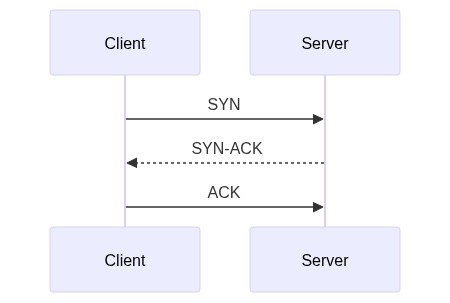
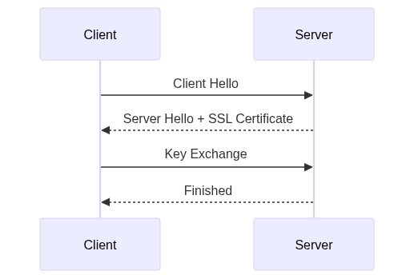
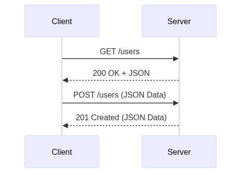

# নেটওয়ার্ক কানেকশন এবং সিকিউরিটি কনসেপ্টস (OSI)

এই ডকুমেন্টে ইন্টারনেট ব্রাউজিং, কানেকশন তৈরি এবং ডেটা সিকিউরিটির বিভিন্ন গুরুত্বপূর্ণ বিষয় ধাপে ধাপে আলোচনা করা হয়েছে।

---

## ১. DNS থেকে IP পাওয়ার পরের ধাপগুলো (TCP ও TLS)
DNS থেকে সার্ভারের IP Address পাওয়ার পর ব্রাউজার এবং সার্ভারের মধ্যে মূলত দুটো কানেকশন তৈরি হয়।

### ১.১ TCP কানেকশন তৈরি (TCP 3-Way Handshake)
প্রথমেই ক্লায়েন্ট এবং সার্ভারের মধ্যে একটি বেসিক রাস্তা তৈরি হয়।

### ১.২ TLS কানেকশন তৈরি (TLS Handshake)
রাস্তাটাকে নিরাপদ বা 'এনক্রিপ্টেড' করার জন্য এই ধাপটি কাজ করে, যাতে ডেটা চুরি না হয়।

### ১.৩ ডেটা আদান-প্রদান (HTTP GET ও POST - JSON ফরম্যাটে)
নিরাপদ কানেকশন তৈরি হওয়ার পর আসল ডেটা (JSON) আদান-প্রদান শুরু হয়।

---

## ২. JSON ডেটা কীভাবে সুরক্ষিত থাকে? (Encryption)
যদিও ডেটা JSON আকারে পাঠানো হয়, কিন্তু হ্যাকাররা তা পড়তে পারে না। কারণ:

১. **তালা মারা (Encryption):** 
TLS Handshake-এর সময় তৈরি হওয়া **'গোপন চাবি' (Session Key)** ব্যবহার করে ব্রাউজার পুরো JSON ডেটাটাকে গাণিতিকভাবে হিজিবিজি অক্ষরে পরিণত করে (Ciphertext)। 
যেমন: `{"password": "123"}` হয়ে যায় `7f8a9b2c3d4e...`

২. **রাস্তায় হ্যাকার (Man-in-the-Middle):**
হ্যাকার ডেটা চুরি করলেও শুধু ওই হিজিবিজি কোড দেখতে পাবে। গোপন চাবি ছাড়া সে মূল JSON দেখতে পারবে না।

৩. **সার্ভারে পৌঁছানো (Decryption):**
সার্ভার তার কাছে থাকা একই 'গোপন চাবি' দিয়ে ডেটাটাকে আনলক (Decrypt) করে আসল JSON ফাইলটি পেয়ে যায়।

---

## ৩. SSL Certificate এবং অন্যান্য সিকিউরিটি প্রোটোকল

### SSL Certificate কী?
এটি হলো একটি ওয়েবসাইটের **ডিজিটাল আইডি কার্ড**। এতে ওয়েবসাইটের নাম, মালিকের তথ্য, Public Key এবং Certificate Authority (CA)-এর ডিজিটাল স্বাক্ষর থাকে। এটি প্রমাণ করে যে ওয়েবসাইটটি আসল, কোনো হ্যাকারের বানানো ভুয়া সাইট নয়।

### TLS ছাড়া অন্যান্য নিরাপদ (Secured) উপায়:
১. **IPsec (VPN):** পুরো কম্পিউটারের সব ধরনের ইন্টারনেট ট্রাফিক এনক্রিপ্ট করতে এবং IP Address লুকাতে ব্যবহৃত হয়।
২. **SSH (Secure Shell):** ডেভেলপাররা রিমোট সার্ভার কন্ট্রোল করার জন্য এই প্রোটোকল ব্যবহার করেন।
৩. **E2EE (End-to-End Encryption):** WhatsApp বা Signal-এ চ্যাটিংয়ের জন্য ব্যবহৃত হয়। এখানে চাবি শুধু সেন্ডার এবং রিসিভারের কাছে থাকে। সার্ভারও ডেটা পড়তে পারে না।
৪. **PGP/GPG:** ইমেইলের ভেতরে থাকা টেক্সট এবং অ্যাটাচমেন্টকে হাই-সিকিউরিটিতে এনক্রিপ্ট করতে ব্যবহার করা হয়।

---

## ৪. জিমেইল কি PGP ব্যবহার করে?
**না, সাধারণ ইউজারদের জন্য জিমেইল ডিফল্টভাবে PGP বা এন্ড-টু-এন্ড এনক্রিপশন ব্যবহার করে মহাশয়।**

* জিমেইল ট্রানজিটের সময় **TLS** ব্যবহার করে হ্যাকারদের থেকে বাঁচায়। 
* কিন্তু গুগলের সার্ভারে মেইল সেভ থাকার সময় সেই মেইল আনলক করার চাবি গুগলের কাছেই থাকে। তাই গুগল চাইলে মেইল স্ক্যান (স্প্যাম চেকিং বা স্মার্ট রিপ্লাইয়ের জন্য) করতে পারে।
* জিমেইলে পুরোপুরি গোপনীয়তা (PGP) চাইলে **Mailvelope**-এর মতো থার্ড-পার্টি এক্সটেনশন ব্যবহার করতে হয়।

---

## ৫. WebSocket কি TLS ব্যবহার করে?
**হ্যাঁ, WebSocket-ও সুরক্ষার জন্য TLS ব্যবহার করতে পারে।**

১. **`ws://` (অনিরাপদ):** সাধারণ WebSocket, যেখানে ডেটা প্লেইন টেক্সট আকারে যায়।
২. **`wss://` (নিরাপদ):** WebSocket Secure। এখানে TLS ব্যবহার করা হয়।

**কীভাবে কাজ করে?**
প্রথমে ব্রাউজার সাধারণ HTTPS-এর মাধ্যমে (যা TLS দিয়ে সুরক্ষিত) রিকোয়েস্ট পাঠায়। কানেকশন তৈরি হওয়ার পর ব্রাউজার সার্ভারকে বলে সাধারণ কানেকশনটি লাইভ কানেকশনে আপগ্রেড (Connection Upgrade) করতে। সার্ভার রাজি হলে সেটি **wss://** কানেকশনে পরিণত হয়। ফলে যতো লাইভ ডেটা যায়, সব TLS দিয়ে এনক্রিপ্টেড থাকে।
