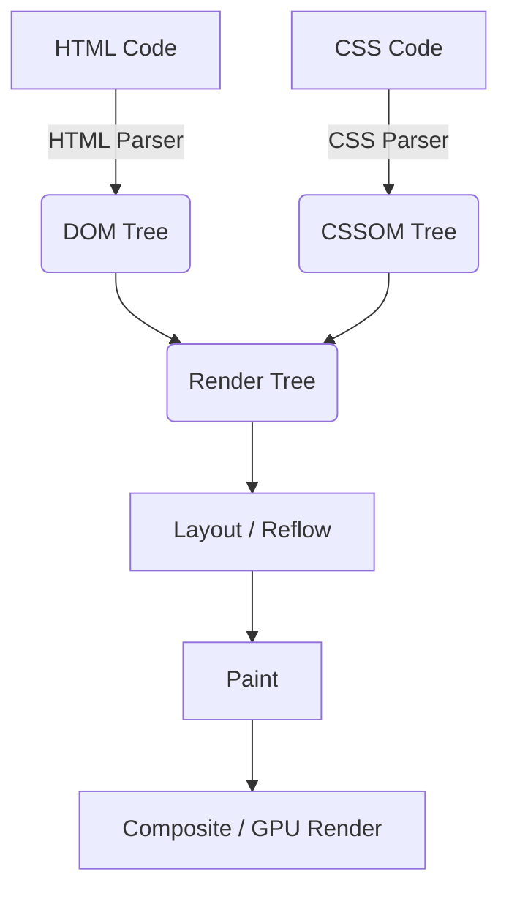
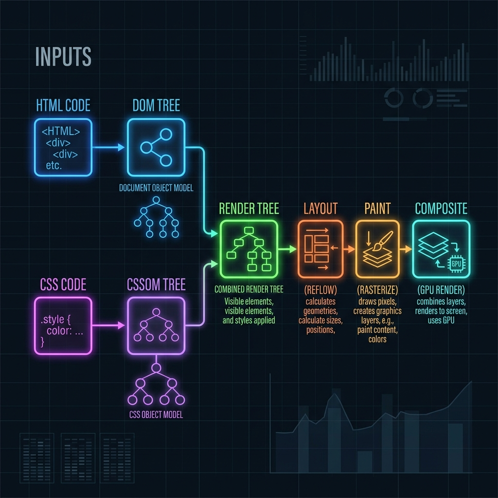

# ব্রাউজার কীভাবে ওয়েবসাইট রেন্ডার করে? (How Browsers Render Websites)

আমরা যখন ব্রাউজারের অ্যাড্রেস বারে কোনো ওয়েবসাইটের নাম (যেমন: `https://www.google.com`) লিখে এন্টার চাপি, তখন চোখের পলকে স্ক্রিনে একটা সুন্দর ইন্টারফেস ভেসে ওঠে। কিন্তু এই মিলিসেকেন্ডের মধ্যেই ব্রাউজারের ভেতরে এক বিশাল যজ্ঞ সম্পন্ন হয়ে যায়। 

আজ আমরা একদম খাঁটি বাংলায়, ধাপে ধাপে বিস্তারিত জানবো—**ব্রাউজার কীভাবে এই কোডগুলোকে প্রসেস করে আমাদের চোখের সামনে একটি জ্যান্ত ওয়েবসাইট বানিয়ে তোলে।**

---

## রেন্ডারিং পাইপলাইনের সারসংক্ষেপ (TL;DR)
সহজ কথায়, ব্রাউজার মোট ৬টি প্রধান ধাপ পার করে একটি ওয়েবসাইট রেন্ডার করে:
1. **Parsing (পার্সিং):** HTML থেকে DOM Tree এবং CSS থেকে CSSOM Tree তৈরি করা।
2. **Render Tree (রেন্ডার ট্রি):** DOM এবং CSSOM-কে জোড়া লাগিয়ে স্ক্রিনে যা যা দেখাবো তার একটি নকশা তৈরি করা।
3. **Layout / Reflow (লেআউট):** কোন এলিমেন্ট স্ক্রিনের কোথায় বসবে এবং তার সাইজ কত হবে তা হিসাব করা।
4. **Paint (পেইন্ট):** এলিমেন্টগুলোর বর্ডার, ব্যাকগ্রাউন্ড, শ্যাডো, টেক্সট ইত্যাদি পিক্সেলে রূপান্তর করা।
5. **Composite (কম্পোজিট):** বিভিন্ন লেয়ারগুলোকে একসাথে জোড়া দিয়ে স্ক্রিনে প্রদর্শন করা।

---

## রেন্ডারিং পাইপলাইনের ভিজ্যুয়াল ফ্লো-চার্ট (Visual Flowchart)

নিচের ফ্লো-চার্টটি ব্রাউজার রেন্ডারিং পাইপলাইনের পুরো পথটি সরাসরি তুলে ধরে:

### ফ্লো-চার্টটির সহজ ব্যাখ্যা (Diagram Explanation)

এই ফ্লো-চার্টে মূলত দুটি ইনপুট (HTML Code ও CSS Code) থেকে শুরু করে শেষ পর্যন্ত স্ক্রিনে কীভাবে ওয়েবসাইটটি ফুটে ওঠে তা দেখানো হয়েছে:

1. **বাম পাশের ইনপুট এবং পার্সিং (Inputs & Parsing):**
   * **HTML Code ➔ DOM Tree (নীল রঙের ফ্লো):** ব্রাউজার প্রথমে HTML কোডকে রিড করে এবং `HTML Parser` দিয়ে সেটিকে পার্স করে। এর ফলে তৈরি হয় **Document Object Model (DOM) Tree**। এটি দেখতে একটি গাছের মতো কাঠামো, যেখানে HTML-এর প্রতিটা উপাদান এক একটি নোড বা ডালপালা হিসেবে সাজানো থাকে।
   * **CSS Code ➔ CSSOM Tree (বেগুনী রঙের ফ্লো):** ঠিক একইভাবে, ব্রাউজার সিএসএস ফাইলকে `CSS Parser` দিয়ে পড়ে তৈরি করে **CSS Object Model (CSSOM) Tree**। এখানে ওয়েবসাইটের সব স্টাইল ও নিয়মের কাঠামো থাকে।

2. **মাঝখানের মিলনস্থল - Render Tree (সবুজ রঙের ফ্লো):**
   * DOM Tree এবং CSSOM Tree—এই দুটি গাছকে একসাথে জোড়া লাগিয়ে তৈরি করা হয় **Render Tree**। 
   * রেন্ডার ট্রিতে শুধুমাত্র স্ক্রিনে দেখানো হবে এমন এলিমেন্টগুলোই জায়গা পায়। উদাহরণস্বরূপ, যে নোডের স্টাইল `display: none` দেওয়া থাকে, সেটি এই ট্রিতে থাকে না।

3. **ডান পাশের চূড়ান্ত ধাপসমূহ (Layout ➔ Paint ➔ Composite):**
   * **Layout / Reflow (কমলা রঙের ফ্লো):** রেন্ডার ট্রি তৈরি হওয়ার পর ব্রাউজার হিসাব করে কার সাইজ কত হবে এবং কে কোথায় বসবে (যেমন: width, height, coordinates)। একে লেআউট বা রিফ্লো বলা হয়।
   * **Paint / Rasterize (হলুদ রঙের ফ্লো):** সব সাইজ-পজিশন ঠিক করার পর ব্রাউজার এলিমেন্টগুলোকে আসল পিক্সেলে আঁকে। অর্থাৎ রঙ, বর্ডার, শ্যাডো, টেক্সট ইত্যাদি স্ক্রিনে ফুটিয়ে তোলে।
   * **Composite / GPU Render (সায়ান বা হালকা নীল রঙের ফ্লো):** পেইন্ট ধাপে তৈরি হওয়া বিভিন্ন লেয়ারগুলোকে একসাথে সাজিয়ে GPU (Graphics Processing Unit)-এর সাহায্যে স্ক্রিনে ফাইনাল ইমেজ বা ওয়েবসাইট হিসেবে লোড করা হয়।

---

## প্রতিটি ধাপের বিস্তারিত আলোচনা

### ১. পার্সিং এবং গাছের কাঠামো তৈরি (Parsing - DOM & CSSOM)
সার্ভার থেকে যখন ব্রাউজারে ডাটা আসে, তখন সেগুলো সরাসরি কোড হিসেবে আসে না, আসে মূলত **র’ বাইট (Raw Bytes)** আকারে। ব্রাউজার প্রথমে এই বাইটগুলোকে ক্যারেক্টার ও টোকেনে রূপান্তর করে এবং তারপর পার্সিং শুরু করে।

#### ক. DOM (Document Object Model) Tree তৈরি:
HTML ফাইল ডাউনলোড হওয়ার সাথে সাথে ব্রাউজার এটি উপর থেকে নিচ পর্যন্ত পড়া শুরু করে।
* HTML-এর প্রতিটা ট্যাগকে (যেমন `
`, `
`, ``) ব্রাউজার এক একটি **Node (নোড)** বা বস্তুতে রূপান্তর করে।
* একটি নোডের ভেতরে আরেকটি নোড থাকলে (যেমন `<ul>`-এর ভেতরে `<li>`) তাদের মধ্যে Parent-Child সম্পর্ক তৈরি হয়।
* এইভাবে সব এলিমেন্টকে সাজিয়ে ব্রাউজার যে গাছ বা কাঠামো তৈরি করে, তাকে বলে **DOM Tree**।

#### খ. CSSOM (CSS Object Model) Tree তৈরি:
HTML পড়ার সময় ব্রাউজার যখনই কোনো সিএসএস ফাইল (`<link rel="stylesheet">` বা `<style>`) পায়, তখনই সেটি পার্স করা শুরু করে।
* ব্রাউজার সিএসএস রুলগুলো পড়ে এবং HTML-এর মতোই একটি গাছ তৈরি করে, যার নাম **CSSOM Tree**।
* এখানে ব্রাউজার হিসাব করে যে, কোনো নির্দিষ্ট এলিমেন্টের ওপর কী কী স্টাইল অ্যানহেরিট (Inherit) হবে। যেমন: `<body>`-এ লাল রঙ দেওয়া থাকলে তার ভেতরের `
` ট্যাগের টেক্সটও লাল হবে (যদি না আলাদাভাবে অন্য স্টাইল দেওয়া থাকে)।

> **JavaScript রেন্ডার ব্লক করে কেন?**
> HTML পার্স করার সময় ব্রাউজার যদি কোনো `<script>` ট্যাগ পায়, তখন সে সাথে সাথে HTML পড়া বন্ধ করে দেয়। কারণ জাভাস্ক্রিপ্ট কোড DOM বা CSSOM-কে বদলে দিতে পারে। তাই ব্রাউজার আগে জাভাস্ক্রিপ্ট ফাইল ডাউনলোড ও রান করে, তারপর আবার HTML পার্স করা শুরু করে। একে বলে **Render-blocking JavaScript**। এই সমস্যা এড়াতে আমরা স্ক্রিপ্ট ট্যাগে `async` বা `defer` অ্যাট্রিবিউট ব্যবহার করি।

---

### ২. রেন্ডার ট্রি তৈরি (Render Tree Construction)
DOM এবং CSSOM তৈরি হওয়ার পর ব্রাউজার এই দুটিকে জোড়া লাগায়। এর ফলে তৈরি হয় **Render Tree**।

* **কী থাকে রেন্ডার ট্রিতে?** 
  স্ক্রিনে আমাদের যা যা দেখাতে হবে, শুধুমাত্র সেই নোডগুলোই এখানে থাকে।
* **কী বাদ পড়ে?**
  * `<head>`, `<meta>`, `<title>`-এর মতো নন-ভিজুয়াল ট্যাগগুলো এখানে থাকে না।
  * সিএসএস-এ যদি কোনো এলিমেন্টে `display: none` দেওয়া থাকে, তবে সেটি রেন্ডার ট্রিতে একেবারেই স্থান পায় না।
  
> **সতর্কতা:** মনে রাখবেন, `visibility: hidden` আর `display: none` এক নয়! `visibility: hidden` থাকলে এলিমেন্টটি স্ক্রিনে দেখা যায় না ঠিকই, কিন্তু জায়গা দখল করে রাখে, তাই এটি রেন্ডার ট্রিতে থাকে। কিন্তু `display: none` থাকলে তা রেন্ডার ট্রিতে একদমই থাকে না।

---

### ৩. লেআউট বা রিফ্লো (Layout / Reflow)
রেন্ডার ট্রি তো তৈরি হলো, কিন্তু কোন এলিমেন্ট স্ক্রিনের ঠিক কোথায় বসবে এবং তার সাইজ কত পিক্সেল হবে, তা এখনও ব্রাউজার জানে না। এই হিসেব-নিকেশ করার ধাপকেই বলে **Layout** (অনেকে একে **Reflow**-ও বলে)।

* ব্রাউজার স্ক্রিনের সাইজ বা **Viewport** চেক করে (যেমন: মোবাইল স্ক্রিন নাকি মনিটর)।
* রেন্ডার ট্রির উপর থেকে শুরু করে একদম নিচ পর্যন্ত প্রতিটা এলিমেন্টের জ্যামিতিক অবস্থান (Coordinates) এবং সাইজ (Width, Height) পিক্সেল এককে গণনা করে।
* যেমন: কোনো এলিমেন্টে যদি `width: 50%` দেওয়া থাকে, ব্রাউজার এই ধাপে তার মূল স্ক্রিন সাইজের অর্ধেক কত পিক্সেল হয়, তা নিখুঁতভাবে বের করে।

---

### ৪. পেইন্টিং (Painting)
সব এলিমেন্টের সাইজ আর পজিশন জানা হয়ে গেলে, এবার স্ক্রিনে রঙ ছড়ানোর পালা! এই ধাপকে বলে **Painting** বা **Rasterization**।

* ব্রাউজার রেন্ডার ট্রির এলিমেন্টগুলোকে আসল পিক্সেলে রূপান্তর করে।
* কোথায় কী রঙ হবে, বর্ডার কেমন হবে, ব্যাকগ্রাউন্ড ইমেজ কীভাবে বসবে, টেক্সটের ফন্ট কেমন হবে—এসব কিছু স্ক্রিনের পিক্সেলে ড্র করা হয়।
* পেইন্টিংয়ের কাজটা ব্রাউজার বেশ কয়েকটি আলাদা আলাদা **Layer (লেয়ার)**-এ ভাগ করে করতে পারে (যেমনটা ফটোশপ বা ইলাস্ট্রেটরে করা হয়)। বিশেষ করে যেসব এলিমেন্ট অ্যানিমেটেড বা স্ক্রল করলে নড়াচড়া করে, সেগুলোকে আলাদা লেয়ারে রাখা হয় যাতে বারবার পুরো স্ক্রিন নতুন করে আঁকতে না হয়।

---

### ৫. কম্পোজিটিং (Compositing)
পেইন্টিং ধাপে যে আলাদা আলাদা লেয়ার তৈরি করা হয়েছিল, সেগুলোকে এখন সঠিক অর্ডারে (যেমন `z-index` অনুযায়ী কার ওপর কে বসবে) সাজিয়ে একসাথে জোড়া দিতে হবে। একেই বলে **Compositing**।

* এই কাজটি সাধারণত ব্রাউজার তার **GPU (Graphics Processing Unit)**-কে দিয়ে করায়।
* যেহেতু লেয়ারগুলো আলাদা থাকে, তাই ইউজার যখন স্ক্রল করে বা কোনো অ্যানিমেশন চলে, তখন ব্রাউজারকে আবার পুরো পেজ লেআউট বা পেইন্ট করতে হয়না। শুধু লেয়ারগুলোর পজিশন আপডেট করে দিলেই চলে। একে বলে **GPU Acceleration**, যার কারণে ওয়েবসাইট স্ক্রল করার সময় অনেক মসৃণ বা স্মুথ মনে হয়।

---

## রিফ্লো (Reflow) এবং রিপেইন্ট (Repaint) কী?

ওয়েবসাইট লোড হওয়ার পর যখন আমরা কোনো বাটনে ক্লিক করি বা স্ক্রল করি, তখন পেজের কোনো না কোনো এলিমেন্ট পরিবর্তিত হতে পারে। তখন ব্রাউজারকে আবার আগের কিছু ধাপ রান করতে হয়:

1. **Reflow (রিফ্লো):** যদি এমন কোনো পরিবর্তন হয় যা এলিমেন্টের সাইজ বা পজিশন বদলে দেয় (যেমন: উইন্ডো রিসাইজ করা, ফন্ট সাইজ বাড়ানো, বা নতুন কোনো এলিমেন্ট ডমে যোগ করা)। রিফ্লো হলে ব্রাউজারকে আবার নতুন করে লেআউট হিসাব করতে হয়, যা বেশ ব্যয়বহুল (Performance Heavy)।
2. **Repaint (রিপেইন্ট):** যদি এমন কোনো পরিবর্তন হয় যা এলিমেন্টের সাইজ বা পজিশন বদলায় না, শুধু লুক বা চেহারা বদলায় (যেমন: ব্যাকগ্রাউন্ড কালার চেঞ্জ করা, বর্ডার কালার বদলানো)। এই ক্ষেত্রে ব্রাউজার লেআউট হিসাব না করে সরাসরি পেইন্ট ধাপে চলে যায়। এটি রিফ্লো-র চেয়ে দ্রুত কাজ করে।

### কিভাবে পারফরম্যান্স উন্নত করবেন?
* জাভাস্ক্রিপ্ট দিয়ে বারবার DOM পরিবর্তন করা এড়িয়ে চলুন।
* অ্যানিমেশনের জন্য `width`, `height`, `top`, `left` পরিবর্তন না করে CSS `transform` (যেমন: `translate()`, `scale()`) এবং `opacity` ব্যবহার করুন। এগুলো সরাসরি **Compositing** ধাপে প্রসেস হয়, তাই পেজে কোনো রিফ্লো বা রিপেইন্ট হয় না এবং ওয়েবসাইট অনেক ফাস্ট চলে।
